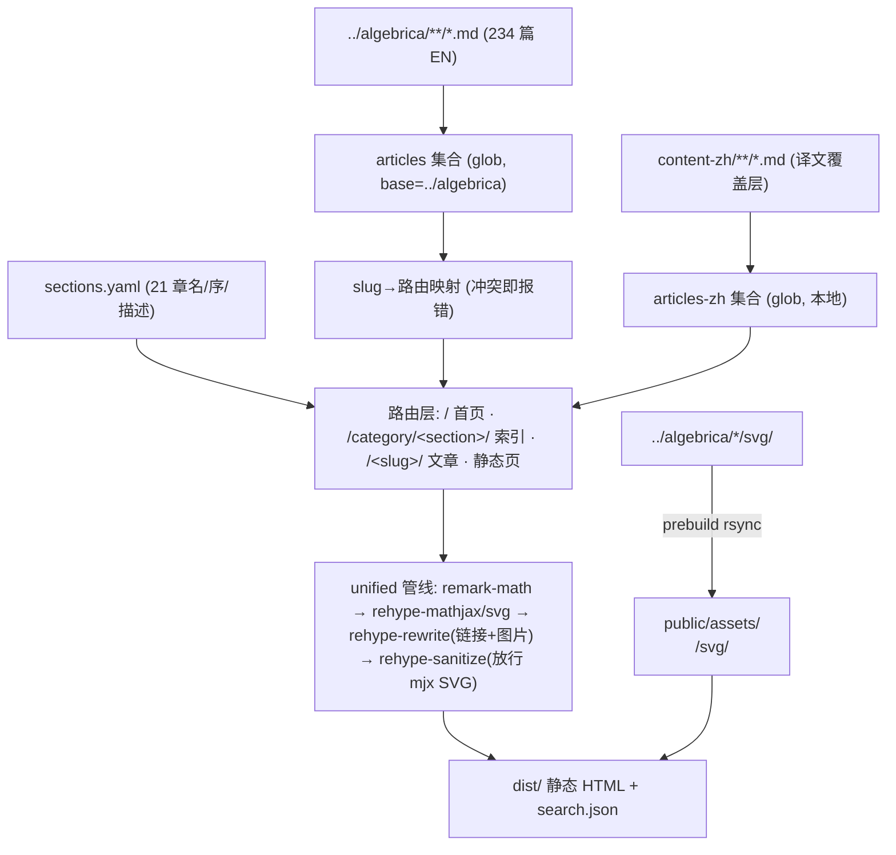

# Algebrica 简体中文复刻站 - Plan

**目标仓库:** 本仓库(algebrica-zh,空目录起步)。**内容源:** `../algebrica`(antoniolupetti/algebrica 的本地克隆,238 个 markdown、256 个 SVG,CC BY-NC 4.0)。**参考快照:** 原站 CSS/首页/文章页 HTML 抓取于 2026-07-21,实施时从原站重新抓取,不依赖任何临时目录。

## Goal Capsule

- **Objective:** 在空仓库中建一个 Astro 7 静态站,视觉像素级复刻 algebrica.org(原站 CSS/字体逐字直搬),内容管道直读 `../algebrica`,UI 文案简体中文,并带一条术语表驱动、状态可追踪的翻译流水线。
- **Authority hierarchy:** 用户已确认的范围裁决(动态功能全砍/核心页+仓库 pages/本地构建/外壳+流水线先行)> 本计划 > POV 与研究 dossier。
- **Stop conditions:** 范围变化(用户改口);原站资产抓取失败或结构大变;Astro 7 `unified()` 处理器行为与文档不符;主题 CSS 存在无法静态化的部分。遇以上任一项,停下来上报,不猜测。
- **Execution profile:** 全本地、无后端、无部署;所有验证为构建期断言 + 本地渲染比对。
- **Tail ownership:** 实施者负责每个 U 的测试场景与 Verification;DoD 见末节。

---

## Product Contract

### Summary

规划一个 Astro 7 静态站:原站 algebrica.org 的 style.css 与 11 个 woff2 字体逐字直搬,按原站渲染 HTML 重建模板;内容经单一 glob 集合直读 `../algebrica` 的 234 篇文章,构建期完成链接重写与 MathJax SVG 渲染;翻译流水线(omp 委托、术语表 + 遮蔽/还原 + 四件套校验 + 文案 lint + 双闸验收(试点逐篇/放量抽检) + 状态追踪)随站交付,全量 234 篇翻译是后续工作,试点 5–10 篇校准。

### Problem Frame

algebrica.org 是一个 CC BY-NC 4.0 的大学数学知识库,内容以 markdown 开源于 GitHub(已克隆至 `../algebrica`)。用户要一个简体中文版,风格尽可能像素级复刻。原站是 WordPress + 未开源主题,但全部视觉资产(单一 89KB style.css、自托管字体、主题 JS)可经 HTTP 直接抓取;内容 markdown 格式统一(4 字段 frontmatter、`$`/`$$` 数学、扁平永久链接)。许可允许翻译(Adaptation),要求署名、链接、改动声明、非商业。主题代码本身无授权——个人非商业镜像风险低,但 About 页不得主张主题权利。原站的账号/历史/阅读量/热力图/AI 总结是服务端功能,静态站复刻不了,用户已确认全部砍掉,像素级复刻限定于排版、布局、配色、字体。

### Requirements

**站点外壳与视觉**

- R1. 原站 `style.css` 逐字节直搬 + Geist/Geist Mono/EB Garamond woff2 自托管;模板 DOM 的 class 契约对齐原站渲染 HTML(post-header-title、post-section、site-sidebar-right 等)。
- R2. CJK 适配以独立补丁层覆盖在原 CSS 之上(不改原文件):字体栈追加 CJK 回退(正文 `EB Garamond → Noto Serif SC → Songti SC → STSong → SimSun`,UI `Geist → Noto Sans SC → PingFang SC → Microsoft YaHei`)、正文行高 23px→约 29px(1.7)、`lang="zh-CN"`、正文 `hyphens: manual`、`text-autospace` 渐进增强。每项偏离写入 About 页清单。
- R3. 动态功能零残留:账号/登录表单、阅读历史、阅读量计数、贡献热力图、founder campaign、AI 总结、Global views 在模板层整块移除(非 CSS 隐藏),sidebar 导航只留:搜索、首页/索引、参考文献、编辑流程、关于、GitHub 仓库。

**内容与路由**

- R4. 单一 glob 集合 `base: '../algebrica'`、`pattern: ['*/*.md', '!pages/*.md']`(pages/ 两篇无 frontmatter,排除以保 schema 校验与手写静态路由),构建期断言集合非空并报告与 sections.yaml 的差集(防 base 静默空集合;条数随上游更新漂移,不设硬编码失败线);文章扁平路由 `/<slug>/`(slug 全局唯一,构建期冲突即报错),section 索引位于 `/category/<section>/`(镜像原站 WordPress URL,已实测 `/category/functions/` 200;10 个 section 存在同名文章 slug,扁平方案相撞不可行),`build.format: 'directory'` + `trailingSlash: 'always'`。
- R5. 内部链接重写:`../<slug>/` 目标三分处理——文章 slug → 站内路由;section 目录名 → `/category/<section>/` 索引;dangling(原站存在但 repo 未迁移 → 渲染为指向 `algebrica.org/<slug>/` 的外链;原站也不存在 → 渲染为无链接纯文本)。各类目计数不硬编码,以 U2 重写插件构建期实测输出(`dangling-links.json` + 链接解析报告)为唯一真源。
- R6. SVG 资产:`prebuild` 脚本把 `../algebrica/<section>/svg/` 同步到 `public/assets/<section>/svg/`(保留 section 结构,17 处跨 section 引用因此不断),图片路径由重写插件指向 `/assets/...`;283 处引用必须 0 缺失。

**数学渲染**

- R7. 构建期渲染为 MathJax SVG(`rehype-mathjax/svg`,与原站客户端 tex-svg 同源输出,零客户端 JS);4 个 torture 文件(properties-of-real-numbers、median-and-quantiles、irrational-equations、limits)冒烟通过,全站构建零 `mjx-error`。

**页面**

- R8. 首页 = 中文改写 hero 三栏 + 原站自托管 mp4 视频 + 21 章编号索引(沿用原站 1./1.1 编号,无 view 数)。章名/顺序/条目顺序/描述段来自一次性抓取的 `sections.yaml`(21 个内容 section;原站第 22 章 Kinematics 在 repo 中无内容,不做)。
- R9. Section 索引页 = 中文章名 + 中文描述段 + 条目卡片(未翻译条目带徽标,无日期、无 view 数)。
- R10. 文章页 = 面包屑(指向 section 索引)+ 标题 + 正文 + 页尾署名块(原文标题、frontmatter `source:` 链接、"本文译自 Algebrica,CC BY-NC 4.0,有翻译改动")+ 未翻译时顶部横幅("本文尚未翻译,以下为英文原文");不展示 tags、日期、阅读量。
- R11. 静态页:`/bibliography/`、`/editorial-process/`(repo `pages/` 源,经翻译管线译出,中文标题写死于模板)+ 新写中文 `/about/`(项目说明、署名、许可、与原站关系、偏离清单)。
- R12. 搜索:静态 JSON 索引(条目 = zh 标题 + en 标题 + en tags + 术语表派生 zh 关键词 + url)+ 客户端下拉建议(top 5,加权评分,复刻原站交互),Enter 跳转第一条建议。

**翻译流水线**

- R13. `glossary.yaml`:`terms`(en/zh/note 固定映射,数学核心词起步)+ `do_not_translate`(KaTeX、Algebrica 等);译后固定映射 grep 校验(源含 `function` 处译文必为 `函数`)。
- R14. 遮蔽-翻译-还原:翻译前把 frontmatter(仅译 `title` 值)、`$…$`/`$$…$$`(含多行环境)、链接 URL、图片路径替换为占位符,译后无损还原并校验占位符计数与顺序。
- R15. 译后校验四件套:占位符还原校验、`$`/`$$` 定界符配对、KaTeX strict 重解析(lint 级)、frontmatter schema + 内部链接目标存在性;另约束译文不得含原始 HTML 与 `javascript:` URL(构建侧 unified 链末端 rehype-sanitize 兜底,schema 放行 mjx SVG 元素/属性)。
- R16. 状态追踪:译文 frontmatter 携带 `translation: {status, source_hash, translator, updated}`;`status`/`verify` 脚本报 current/stale/missing 三态,源文件 hash 变化即 stale,增量重译只跑 stale 集。
- R17. 中文文案 lint(源码层,依 `chinese-copywriting-guidelines` skill):中英文/中文数字间空格、全角标点、「」引号、半角数字、专名大小写。
- R18. 试点翻译 5–10 篇(跨 section 选取,含 1 篇 torture 文件)校准 prompt 与术语表,作为站点验收的演示译文。
- R20. 验收把关:试点期每篇译文过双闸方可落盘——自动闸(R15 四件套 + R17 lint)与编排方逐篇审读(术语一致、数学无损、还原完整、流畅度抽查);不合格带反馈重译(同篇 ≤2 次,超限标记人工)。放量期自动闸始终全量、审读闸降抽检(放量触发条件与无人值守时的审读主体见 Open Questions)。

**合规**

- R19. 全站 footer 保留 license 行(中文改写,链接原站与 CC BY-NC 4.0);About 页只署名内容,不主张主题/设计权利。

### Scope Boundaries

**Deferred to Follow-Up Work**

- 全量 234 篇翻译(流水线就绪后的持续工程)。
- Noto Serif SC webfont 自托管子集化(跨平台 CJK 一致性增强,见 Open Questions)。
- `/search/` 全文结果页、tags 翻译、Pagefind。
- 部署到静态托管。
- 上游 15 篇未迁移内容(含 Kinematics 整章)与上游断链(计数以 U2 实测为准)——构建报告产出后给上游提 issue。

**Outside this product's identity**

- WordPress、任何后端、账号系统。
- 整站抓取式镜像(仅抓取首页/文章页/category 页作为 DOM 结构参照)。
- 动态功能的静态近似(localStorage 历史等)——用户已明确砍掉。

### Acceptance Examples

- AE1. 读者打开首页:看到中文 UI、hero、视频、21 章编号索引;点击"积分"章 → section 索引(中文描述段);点击已翻译条目 → 中文文章页(公式 SVG 渲染、SVG 插图显示、页尾署名块)。
- AE2. 读者点击未翻译条目(上线初期多数):同一文章模板渲染英文原文 + 顶部未翻译横幅;section 索引中该条目带"未翻译"徽标。
- AE3. 读者在文章页点击 `../functions/` 链接 → 落到本站 functions section 索引;点击指向 `../velocity/`(repo 未迁移)→ 新开 algebrica.org 原站页;点击指向不存在 slug → 纯文本无链接。
- AE4. 读者搜索"导数"与"derivative":均能下拉命中《导数》条目(top 5 内),Enter 跳转第一条。
- AE5. 流水线操作者重跑翻译:仅 stale(源 hash 变化)与 missing 的条目被重译;`verify` 脚本输出三态清单。

---

## Planning Contract

### Key Technical Decisions

- **KTD-1. Astro 7 + `unified()` 处理器。** Astro 7(2026-06-22)默认 Markdown 处理器换成 Rust 系 Sätteri,无数学渲染生态;必须显式安装 `@astrojs/markdown-remark` 并配置 `markdown: { processor: unified({ remarkPlugins, rehypePlugins }) }` 拿回 remark/rehype 生态。Node 要求 ≥22.12。依据:docs.astro.build/en/guides/upgrade-to/v7/。
- **KTD-2. 数学 = `remark-math` + `rehype-mathjax/svg`(构建期)。** 原站客户端 MathJax 3 tex-svg;rehype-mathjax 构建期产出同源 `<mjx-container jax="SVG">`,像素最近、零客户端 JS、无需加载字体/CSS。构建性能疑虑已被实测解除:全部 28,984 条真实公式经 mathjax-full 3.2.1 渲染 5.9 秒、0 错误(2026-07-21 本机基准,见 Sources)。KaTeX 仅作休眠备选(仅当全量构建 > 10 分钟时启用,见 U3 验收),不作默认——其字形/间距与原站不同;另作翻译校验 lint。依据:github.com/remarkjs/remark-math 各包 README + 实测基准。
- **KTD-3. 内容 = 单一 glob 集合直读 `../algebrica`。** loader 官方支持 "anywhere on the filesystem",`base` 相对 `process.cwd()` 解析;`pattern: ['*/*.md', '!pages/*.md']`——`*/*` 深度天然排除根级 LICENSE/README,`!pages` 排掉两篇无 frontmatter 静态页(防 schema 校验破坏构建、防与手写静态路由冲突),集合条目 = 234。已知陷阱:base 无效会静默产出空集合——构建期断言"非空 + 与 sections.yaml 差集报告"兜底(条数随上游漂移,不硬编码,口径见 U2)。条目 id 形如 `integrals/definite-integrals`,split 取 section 与 slug。依据:docs.astro.build/en/guides/content-collections/ + issue #12795。
- **KTD-4. 扁平文章路由 + `/category/` section 索引 + 单一重写插件。** 文章 `/<slug>/`(234 slug 已实测全局唯一,`getStaticPaths` 冲突即 throw);section 索引 `/category/<section>/`——镜像原站 WordPress URL(2026-07-21 实测:`/category/functions/` 索引页与 `/functions/` 文章页并存),且 10 个 section(complex-numbers、derivatives、differential-equations、equations、functions、inequalities、limits、polynomials、sequences、series)存在 `<section>/<section>.md`,扁平 `/<section-dir>/` 会与文章 slug 同路径相撞,故不可行。一个自定义 rehype 插件同时处理 `<a href^="../">` 三分(站内/外链/纯文本)与 `` 两种形态——`src^="svg/"` 与跨 section `src^="../<section>/svg/"`(实测 17 处)——统一重写为 `/assets/<section>/svg/`(本 section 自 `file.history[0]` 推得,跨 section 自路径解析);slug→路由映射构建一次,getStaticPaths 与插件共享。
- **KTD-5. zh 译文 = 本地覆盖层集合。** 译文存本仓库 `content-zh/<section>/<slug>.md`(第二 glob 集合),按 section/slug 与 EN 源配对:有译文渲染中文,无译文渲染英文原文 + 横幅(AE2)。裁决理由:`../algebrica` 是上游克隆,必须保持只读以维持 `git pull` 同步上游与向上游提 issue 的能力;三个替代方案(就地翻译 fork、单集合 lang 字段、zh 文件放 EN 旁)都要求写入上游目录,否决。代价仅为构建期一次 section/slug join,且译文作为本项目主张的 Adaptation,独立归属在许可署名上更干净。**状态真源**:`src/lib/translation-index.mjs` 输出 join 后条目视图 `{slug, section, en, zh|null, status}`,路由、重写插件、search.json、索引页共用;裁决规则——站内渲染以"zh 文件存在"为准(stale 译文仍渲染中文),stale 判定仅供流水线重译使用;`translation-status.mjs` 复用同一 hash 比对函数。译文 frontmatter:`title`(中文)、`title_en`、`source`、`license`、`tags`(沿用英文)、`translation.{status, source_hash, translator, updated}`。
- **KTD-6. 主题资产逐字直搬 + CJK 补丁层分层。** style.css 原样入 `public/theme/`(或全局 CSS import),不做选择器级改写;所有中文适配(R2 全部偏离项)集中在一份 `zh-overrides.css`,后加载覆盖。补丁层是"verbatim 原则"的唯一有意偏离点,清单入 About 页。字体可用 Astro Fonts API(11 个 woff2)或原 CSS 自带 @font-face + `public/theme/fonts/`——实现期取更贴近原 CSS 的后者优先。
- **KTD-7. 搜索 = 手写 JSON 索引,不用 Pagefind。** 原站就是 49KB `{title,url,tags}` JSON + 客户端加权下拉;静态 endpoint(`src/pages/search.json.ts`)+ 小组件复刻该交互,中文标题子串匹配绕开 CJK 分词质量问。Pagefind 仅在将来需要全文搜索时再评估(YAGNI)。
- **KTD-8. section 元数据一次性抓取固化。** 21 个 section 的英文名/curated 顺序/条目顺序/描述段只存在于原站渲染 HTML——构建前置任务抓取固化为本仓库 `sections.yaml`(中文名抓取时人工一次给出,中文描述段由 U6 流水线译出),运行时不依赖原站。
- **KTD-9. 翻译流水线 = 遮蔽→omp 单篇翻译→还原→四件套校验→文案 lint→编排方验收。** 翻译执行委托本机 omp(oh-my-pi v17.0.5,已实测安装)——用户 2026-07-21 明确指定:驱动脚本对每篇文章调一次 `omp -p --no-session --no-tools`(非交互、零工具、每次恰一篇;prompt 契约:只输出译文正文,禁止前言/围栏/解释,驱动对 stdout 先做围栏清洗再进还原),模型与认证由 omp profile 管理,仓库代码零密钥(原 API key 入库风险随之化解);omp 调用收敛为 `scripts/translate.mjs` 单点封装,更换执行体只改一处。整篇一次翻译(实测 avg 10.6KB、max 21.6KB ≈ 6k tokens,不切分);试点期串行,前一篇验收通过再译下一篇;术语表常驻 prompt;prompt 经 `@临时文件` 传入(避免 argv 转义与长度问题),驱动负责创建/删除并保证进程级唯一名,结构 = 输出契约 + glossary + 遮蔽后正文。omp 失败语义显式定义:`--max-time` 上限防悬挂、exit code 非零即失败、空输出/无正文判失败,任何失败不写 `content-zh/`(永不落半截);可恢复错误重试 ≤2 次,终败 slug 记入 `translation-failures.json` 待人工。**验收把关(用户要求):** 试点期每篇过双闸——自动闸(四件套 + 文案 lint)与编排方审读闸(术语一致性、数学无损、链接/图片还原、流畅度抽查),拒绝则带反馈重译(同篇 ≤2 次,超限标记人工);放量期自动闸始终全量、审读闸降抽检。遮蔽清单:frontmatter(仅译 title 值)、数学、链接 URL、图片路径、tags 数组。成本:omp 后端定价取决于其 provider 配置,原 Anthropic API 成本信封作废——试点逐篇记录耗时与用量,外推后定全量节奏(OQ3)。
- **KTD-10. 首页保留 hero + 视频 + 索引,其余整块删。** hero 三栏文案改写为中文镜像语境;mp4 是静态资源零成本保留;campaign/heatmap/历史/AI 总结/Global views 模板层移除。`compressHTML: true`(v7 默认 `'jsx'` 会吃掉行内元素间空格,是像素风险,改回旧行为)。

### High-Level Technical Design

内容构建数据流(渲染侧):



翻译流水线生命周期(生产侧,产出 `content-zh/`):

```mermaid
flowchart TB
  SRC["EN 源文件"] --> HASH{"source_hash 比对"}
  HASH -->|current| SKIP["跳过"]
  HASH -->|missing/stale| MASK["遮蔽: frontmatter/数学/链接/图片 → 占位符"]
  MASK --> LLM["omp 单篇翻译 (glossary 注入 prompt)"]
  LLM --> REST["还原占位符 + 计数/顺序校验"]
  REST --> VAL["四件套: 定界符配对 · KaTeX strict · schema · 链接目标"]
  VAL --> LINT["中文文案 lint: 盘古空格/全角标点/引号"]
  LINT --> GATE{"编排方验收 (R20)"}
  GATE -->|拒绝: 反馈重译 ≤2| LLM
  GATE -->|超限(>2): 标记人工| MANUAL["人工翻译/复核队列 (不落盘)"]
  GATE -->|通过| WRITE["落盘 content-zh/<section>/<slug>.md + translation frontmatter"]
  WRITE --> SITE["渲染侧: 有译文→中文页; 无→英文+横幅"]
```

### Output Structure

```text
algebrica-zh/
├── astro.config.mjs            # unified 处理器、trailingSlash、compressHTML
├── package.json                # prebuild: SVG 同步 + 资产校验
├── sections.yaml               # 21 章:en/zh 名、顺序、条目顺序、描述段(一次性抓取固化)
├── glossary.yaml               # 术语表:terms + do_not_translate
├── src/
│   ├── content.config.ts       # articles(../algebrica)+ articles-zh(content-zh)两集合
│   ├── plugins/
│   │   └── rehype-rewrite-algebrica.mjs   # 链接三分 + 图片路径重写
│   ├── lib/
│   │   ├── slug-map.mjs        # slug→路由映射,集合与插件共享
│   │   ├── translation-index.mjs  # EN/ZH join 后条目视图 {slug, section, en, zh|null, status},四方共用真源
│   │   ├── dangling-links.json # 已知 dangling 分类清单(外链/纯文本;计数以 U2 实测校准)
│   │   └── sections.mjs        # sections.yaml 读取
│   ├── layouts/BaseLayout.astro   # sidebar 导航、footer license、搜索框
│   ├── pages/
│   │   ├── index.astro         # 首页:hero + 视频 + 21 章索引
│   │   ├── category/[section]/index.astro  # section 索引页(镜像原站 /category/ URL)
│   │   ├── [slug].astro        # 文章页(横幅/署名块)
│   │   ├── about.astro         # 新写中文 About
│   │   ├── bibliography.astro  # 经管线译出
│   │   ├── editorial-process.astro
│   │   └── search.json.ts      # 搜索索引 endpoint
│   └── styles/zh-overrides.css # CJK 补丁层(字体栈/行高/lang/hyphens)
├── public/
│   ├── theme/style.css         # 原站逐字直搬
│   ├── theme/fonts/*.woff2     # 11 个自托管字体
│   ├── theme/images/           # icon-algebrica.svg 等
│   ├── media/                  # 原站 hero mp4
│   └── assets/<section>/svg/   # prebuild 生成,不提交
├── content-zh/<section>/<slug>.md  # 译文覆盖层(试点 5–10 篇起步)
├── scripts/
│   ├── fetch-assets.mjs        # 抓取原站 CSS/字体/图片/视频 + sections.yaml 抓取
│   ├── sync-svg.mjs            # prebuild SVG 同步
│   ├── lib/mask-restore.mjs    # 遮蔽/还原纯逻辑(可 import 单测)
│   ├── translate.mjs           # 编排:遮蔽→LLM→还原→校验→lint→落盘
│   ├── validate-translation.mjs# 四件套 + 文案 lint(可独立跑)
│   └── translation-status.mjs  # status/verify 三态报告
├── tests/
│   ├── fixtures/               # 小样本 md / hast
│   └── unit/
│       ├── slug-map.test.mjs   # 含冲突注入(不触碰只读上游仓库)
│       ├── rehype-rewrite-algebrica.test.mjs  # 链接三分 + 图片重写
│       └── mask-restore.test.mjs              # 遮蔽/还原 round-trip
└── docs/plans/                 # 本计划
```

`package.json` 携带 `"test": "node --test tests/"`(Node ≥22 自带 runner,零新依赖)。

### Assumptions

- 流水线运行环境 = 用户本机(omp 已装并完成认证);换机运行需先安装 omp;omp 缺失时 translate 脚本显式报错而非静默跳过。
- 原站短期内结构不剧变;sections.yaml 抓取是一次性固化,之后与原站解耦。
- 用户本机为 macOS(Songti SC 可用);Windows 的 SimSun 视觉降级在 Open Questions 中给出对策,不阻塞。

### Open Questions

均 deferred,不阻塞实施:

- OQ1(deferred). 是否 ship Noto Serif SC webfont(fontsource 分片 + `font-display: optional`)换取 Windows 端衬线一致性?默认不 ship,系统字体栈先行;视觉比对后若 Windows 不可接受再加。
- OQ2(deferred). hero 文案中 GitHub/贡献链接指向原项目还是未来的 zh 仓库?默认指向原项目(zh 仓库尚不存在)。
- OQ3(deferred). 试点之外的翻译节奏(按 section 批还是按 tags 批)?默认按 section 批,与目录结构一致。

---

## Implementation Units

### U1. 项目骨架与原站资产固化

- **Goal:** Astro 7 空壳可跑,原站全部视觉资产与 section 元数据固化进仓库。
- **Requirements:** R1, R3(素材面), R8(素材面)
- **Dependencies:** 无
- **Files:** `package.json`, `astro.config.mjs`, `scripts/fetch-assets.mjs`, `sections.yaml`, `public/theme/`(style.css、fonts/、images/), `public/media/`
- **Approach:** 官方脚手架起 Astro 7(确认 Node ≥22.12);`fetch-assets.mjs` 抓取:style.css(无 `?ver=` 参数亦可,记录抓取日期)、11 个 woff2(路径从 style.css @font-face 解析)、icon SVG、hero mp4;同脚本抓首页 Index markup + 21 个 category 页,解析出 `sections.yaml`(en 名、curated 顺序、条目 slug 顺序、英文描述段),中文名由人工随抓取一次性给出(21 个,量小),中文描述段留待 U6 管线填充。`compressHTML: true`、`trailingSlash: 'always'` 在 config 就位。
- **Patterns to follow:** 抓取目标清单直接来自原站 HTML 的 link/script/img 标签,不手抄 URL。
- **Test scenarios:**
  - 抓取后 `public/theme/fonts/` 恰含 11 个 woff2,style.css 非空且含 `Theme Name: Algebrica Dev` 头注释
  - `sections.yaml` 恰 21 个 section,每个含 en 名/顺序/条目列表/描述段;条目 slug 与 `../algebrica` 文件名集合的差集有报告(预期:Kinematics 等 15 篇缺失)
  - 抓取脚本在 style.css 404 时显式失败(不写半截文件)
  - dev-loop 验证:`astro dev` 运行中在本仓库 `content-zh/` 新建临时译文文件,对应页面热重载生效后删除(`../algebrica` 全程零写入——上游只读;外部目录 watch 是已知风险区,见 issue #8369;若失效,在 config 加 `vite.server.fs.allow` 指向父目录并复测)
- **Verification:** `astro dev` 起空壳不报错;资产清单人工核对通过。

### U2. 内容管线:集合、slug 映射与链接/图片重写

- **Goal:** 234 篇文章进入构建,内部链接与 SVG 路径全部正确重写,dangling 有报告。
- **Requirements:** R4, R5, R6
- **Dependencies:** U1
- **Files:** `src/content.config.ts`, `src/lib/slug-map.mjs`, `src/lib/translation-index.mjs`, `src/lib/dangling-links.json`, `src/plugins/rehype-rewrite-algebrica.mjs`, `scripts/sync-svg.mjs`(挂 `prebuild`), `public/assets/`, `tests/unit/slug-map.test.mjs`, `tests/unit/rehype-rewrite-algebrica.test.mjs`, `tests/fixtures/`
- **Approach:** 两集合(articles 读 `../algebrica`(pattern 排除 pages/,恰 234 条),articles-zh 读 `content-zh/`,schema 含 KTD-5 全部字段,EN 侧 `translation` 缺省);slug-map 构建时扫描集合,冲突即 throw;`translation-index.mjs` 为唯一 join 真源(KTD-5 裁决规则);重写插件单 visitor 覆盖 `<a>` 与 ``:文章 slug→`/<slug>/`、section 名→`/category/<section>/`、dangling 外链类(原站存在 repo 未迁移)→`https://algebrica.org/<slug>/`(加 `target="_blank"` 与"英文原站"标记)、纯文本类→解链为纯文本;`svg/x.svg` 与 `../<section>/svg/x.svg`→`/assets/<section>/svg/x.svg`。dangling 清单固化为 `src/lib/dangling-links.json`(初始值按 POV 实测约 8+37 生成,构建期以本插件实测输出为唯一真源);构建报告输出命中计数与新出现(未在清单内)的 dangling——新出现即构建警告。集合条目数断言为"非空 + 与 sections.yaml 差集报告"(条数随上游更新漂移,不硬编码失败线);sections.yaml 有而 repo 无的 section 中,Kinematics 为已知差集常量(原站第 22 章未迁移),不告警,新出现的差集才构建警告。
- **Test scenarios:**
  - 构建断言:集合为空(错误 base)即构建失败;条目恰 234(pages/ 两篇被排除);条目数与 sections.yaml 的差集有报告(当前预期:15 篇上游未迁移;Kinematics 为已知差集常量不告警)
  - 单测(slug-map):注入两个同 slug 不同 section 的条目 → throw 并指出冲突 slug;join 视图对无译文条目给出 `zh: null, status: 'missing'`
  - 单测(rewrite 插件,hast fixture):`[function](../functions/)` → `href="/category/functions/"`;`../definite-integrals/` → `href="/definite-integrals/"`;`../velocity/` → 原站外链带标记;`../quadratic-equation/`(纯文本类清单)→ 纯文本
  - 图片:`integrals` 文章内 `svg/definite-integrals-1.svg` → `/assets/integrals/svg/definite-integrals-1.svg` 且文件存在于 `public/assets/`;17 处跨 section 引用(如 functions 引 `../trigonometry/svg/...`)解析正确
  - 新 dangling(不在清单内)触发构建警告
- **Verification:** 全仓 markdown 渲染后 0 个指向 `.md` 或 `../` 的残留 href;283 处图片 0 404;`node --test` 全绿。

### U3. 数学渲染管线与 torture 冒烟

- **Goal:** 全部数学在构建期渲染为 MathJax SVG,torture 文件通过。
- **Requirements:** R7
- **Dependencies:** U2
- **Files:** `astro.config.mjs`(markdown processor 配置)
- **Approach:** 装 `@astrojs/markdown-remark`、`remark-math`、`rehype-mathjax`;config 显式 `processor: unified({...})`(绕开 Sätteri 默认);先用 4 个 torture 文件单独冒烟,再全量。
- **Test scenarios:**
  - properties-of-real-numbers.md(26 处 `$a<b,$`):无 `mjx-error`,公式数与源 `$$`+`$` 计数一致,`<b,` 未被吞成 HTML 标签
  - median-and-quantiles.md(8 处 `\$` 货币与 `$1{,}500,$` 同段):货币渲染为文本 `$`,真数学渲染为 SVG
  - irrational-equations.md(GFM 表格单元格内单行 `$$...$$`):表格结构完整,单元格内公式渲染
  - limits/limits.md(`\\[6pt]`、多行 aligned):行距与多行环境渲染无错
  - 全量构建:零 `mjx-error`、零 remark 解析错误;统计 234 页总公式数与源计数偏差 = 0
- **Verification:** 4 个 torture 页与 algebrica.org 对应页并排肉眼比对公式形态一致;构建日志干净。计时一次全量生产构建并记录:全量 `astro build` 在 M 系列 Mac 上 < 5 分钟(实测基准 5.9 秒数学渲染,预期总时长 1–2 分钟);仅当 > 10 分钟时启用 KaTeX 休眠备选并在计划变更记录注明。

### U4. 主题外壳:CSS/字体接入与 CJK 补丁层

- **Goal:** 像素级外壳骨架就位:原 CSS/字体接入 + CJK 补丁层 + BaseLayout。
- **Requirements:** R1, R2, R3, R19
- **Dependencies:** U1
- **Files:** `public/theme/style.css`, `src/styles/zh-overrides.css`, `src/layouts/BaseLayout.astro`
- **Approach:** style.css 原样接入,不做选择器级改写;`zh-overrides.css` 后加载,承载 R2 全部偏离项(字体栈/行高/hyphens/text-autospace)。BaseLayout 以原站渲染 HTML(实施时重新抓取)为 DOM 蓝本,照抄 sidebar/footer 的 class 结构与标签层级(v7 严格编译:未闭合标签、`<p>` 内 `<div>` 会报错,照抄时注意);动态模块(登录/历史/views/heatmap/campaign/AI 总结/Global views)整块不搬;导航只留 R3 清单;`lang="zh-CN"` 写死;footer license 行中文改写。移动端行为固化:<1130px 侧栏折叠为顶部条 + 纯 CSS 可展开导航(details/summary,零 JS),断点以原 CSS 媒体查询为准。三个原站没有的新 UI 元素规格(落 zh-overrides.css,复用现有 token,不发明新色):未翻译横幅 = #f4efee 底 + #7f8eac 左侧边框条 + Geist 14px;"未翻译"徽标与"英文原站"外链标记 = 小号 chip(#e9e3e2 底、#312f2f 字、Geist 12px)。本单元用一个占位首页即可独立验证。
- **Test scenarios:**
  - 原 CSS 文件零改动(hash 与抓取时一致),偏离全部只在 zh-overrides.css
  - 页面 `<html lang="zh-CN">`;正文与 UI 字体栈含 CJK 回退链;正文行高约 29px;正文 `hyphens: manual`
  - 骨架 DOM 中无登录、历史、views、heatmap、campaign、summarize-ai、Global views 字样或节点
  - footer license 行存在且链接 CC BY-NC 4.0 与原站
  - 移动端断点(原 CSS 的 1130px 媒体查询)下骨架布局与原站一致,侧栏折叠为顶部条且纯 CSS 展开可用
  - 横幅/徽标/外链标记三元素符合 U4 规格且不引入新色值
- **Verification:** 占位首页与原站并排比对骨架(配色/字体/sidebar/footer/搜索框)肉眼一致。

### U7. 页面模板:首页、section 索引、文章页、静态页

- **Goal:** 5 类页面成型(首页/section 索引/文章/静态页/About)。
- **Requirements:** R8, R9, R10, R11
- **Dependencies:** U2, U4
- **Files:** `src/pages/index.astro`, `src/pages/[section]/index.astro`, `src/pages/[slug].astro`, `src/pages/about.astro`, `src/pages/bibliography.astro`, `src/pages/editorial-process.astro`, `src/lib/sections.mjs`
- **Approach:** 模板照抄原站渲染 HTML 的 class 结构。首页 hero 文案改写为中文镜像语境(指向原项目),mp4 直接引用 `public/media/`,21 章索引读 sections.yaml;section 索引页中文名/描述段 + 条目卡片(状态徽标取 translation-index);文章页分支:无译文→EN body+横幅且文章容器 `lang="en"`(拉丁字体栈回落、读屏按英文),有译文→ZH body 容器 `lang="zh-CN"`,署名块取 frontmatter `source:`/`title`——它是唯一依赖 zh 覆盖层的页面,集成风险最高,排本单元最后;bibliography/editorial-process 标题写死中文,正文先挂 EN 原文(U6 译出后自动切换);About 新写,含 R2 偏离清单与主题权利声明。
- **Test scenarios:**
  - AE1/AE2/AE3 全部走通(U6 未就绪前造 1 篇假译文验证文章页分支)
  - 首页含 hero/视频/21 章编号索引,无 view 数;section 索引未翻译条目带徽标
  - 文章页尾署名块含原文标题与 source 链接;未翻译页有顶部横幅且容器 `lang="en"`,已翻译页 `lang="zh-CN"`
  - 移动端断点下三类页面与原站一致
- **Verification:** 首页、1 个 section 索引、1 篇文章页与 algebrica.org 并排截图比对:配色/字体/间距/布局肉眼一致(除 R2 偏离项与已砍动态模块);AE1–AE3 手动走查。

### U5. 搜索索引与客户端下拉

- **Goal:** 复刻原站下拉式搜索,中英双语可命中。
- **Requirements:** R12
- **Dependencies:** U2, U4(搜索框在 BaseLayout)
- **Files:** `src/pages/search.json.ts`, `src/components/SearchBox.astro`(或 BaseLayout 内联脚本), `glossary.yaml`(种子)
- **Approach:** endpoint 输出条目 `{title_zh, title_en, tags, keywords_zh, url, section}`(keywords_zh 自 glossary.yaml 派生——本单元创建种子:数学核心词 + 常误译词 + `do_not_translate` 框架,U6 扩充至 ~50 词;无译文条目 title_zh 置 null);客户端脚本仿原站:输入→四字段加权子串评分→下拉 top 5→Enter 跳第一条。交互契约:↑/↓ 移动高亮、Enter 打开高亮项(无高亮跳第一条)、Escape 关闭并还原焦点;加载中与请求失败均有中文空态/错误态文案;渲染一律 `textContent` 赋值防注入。
- **Test scenarios:**
  - "导数"与"derivative"均命中导数条目;部分匹配(如"定积")命中"定积分"
  - 无译文条目以英文标题可搜到,展示时标注未翻译
  - 空结果下拉显示空态(不报错);Enter 在 ≥1 条建议时跳转第一条;↑/↓ 高亮 + Enter 打开高亮 + Escape 关闭符合契约;加载中与失败态有中文文案
  - 索引体积 < 200KB(234 条目 + section 项),首屏加载一次
- **Verification:** AE4 手动走查;索引 JSON 字段抽样核对。

### U6. 翻译流水线与试点译文

- **Goal:** 术语表 + 遮蔽/还原 + omp 单篇委托 + 四件套校验 + 文案 lint + 双闸验收 + 状态追踪全链路可跑,产出 5–10 篇试点译文(含 bibliography、editorial-process)。
- **Requirements:** R13, R14, R15, R16, R17, R18, R20, R11(静态页译文)
- **Dependencies:** U2, U7
- **Files:** `glossary.yaml`(U5 种子上扩充), `scripts/lib/mask-restore.mjs`, `scripts/translate.mjs`(omp 驱动), `scripts/validate-translation.mjs`, `scripts/translation-status.mjs`, `translation-failures.json`(失败队列), `tests/unit/mask-restore.test.mjs`, `content-zh/`(试点译文)
- **Approach:** 按 KTD-9 实现单文件流水线:驱动脚本逐篇串行调 omp(每次恰一篇,`omp -p --no-session --no-tools`,prompt 经 `@临时文件` 传入,输出经围栏清洗后回传驱动做还原);glossary.yaml 在 U5 种子基础上扩充至 ~50 词(数学核心词 + 常误译词 + do_not_translate);试点选 5–10 篇跨 section 文章(含 1 篇 torture 文件如 median-and-quantiles)校准 prompt、术语表与验收闸执行;bibliography/editorial-process 无 frontmatter,按正文翻译、译文补 frontmatter。文案 lint 规则依 `chinese-copywriting-guidelines` skill。omp `--mode json` 的输出结构(用量/停止原因元数据)在实现期以一次冒烟调用确认,供截断 guard 使用——停止原因非完赛或输出被截断即判执行失败(走 KTD-9 失败语义,不占 ≤2 审读重试计数)。
- **Test scenarios:**
  - 单测(mask-restore):含数学、链接、图片的 fixture,遮蔽→还原后与源逐 token 一致;占位符计数/顺序被破坏时校验报错
  - 校验器注入测试:译文 `$` 定界符被破坏 → 报错定位;公式被改动 → KaTeX strict 或公式 diff 报错;frontmatter 缺 `title` → schema 报错;固定映射违例(源 `function` 译为非`函数`)→ lint 报错
  - 状态三态:修改 EN 源文件 → `status` 脚本将该条目标 stale;无译文条目报 missing;已译且 hash 一致报 current(与 translation-index 同一 hash 函数)
  - 文案 lint 注入:译文缺中英文间空格/用半角逗号 → 自动修正 + 报告
  - 试点译文渲染:中文页无横幅、公式/图片/链接与 EN 版一一对应
  - 验收闸演练:注入一篇自动闸全绿但术语错译(如 function 译为"功能")的译文 → 编排方审读拦截并触发带反馈重译
- **Verification:** 试点 5–10 篇逐篇过双闸(R20)后落盘;`verify` 输出全绿;AE5 走查;`node --test` 全绿。试点逐篇记录耗时与 omp 用量,外推全量节奏(原 API 成本信封随之作废,见 KTD-9)。

---

## Risks & Dependencies

| 风险/依赖 | 等级 | 缓解 |
|---|---|---|
| 主题/设计无许可授权(内容 CC BY-NC 4.0 不覆盖代码) | 低 | 个人非商业镜像;About 页只署名内容、不主张主题权利;若原作者异议即替换外壳 |
| Astro 7 新发布(2026-06-22),Sätteri/Rust 编译器 churn | 中 | 锁 `unified()` 官方支持路径(旧生态);`package.json` pin astro 次版本;出问题退到 Astro 6 成本仅一行依赖 |
| 原站结构变化导致资产/sections 抓取失真 | 低 | 一次性固化进仓库(sections.yaml、public/theme/),之后与原站解耦;重跑脚本有日期记录 |
| `../algebrica` 上游更新 | 低 | 集合断言非空 + 差集报告(不设硬编码条数);slug 冲突构建即报错;stale 检测天然支持增量重译 |
| 外部目录 HMR 失效(issue #8369) | 低 | U1 含 dev-loop 验证场景;兜底 `vite.server.fs.allow` |
| MathJax 构建性能 | 已解除 | 实测基准:28,984 公式 / 5.9s / 0 错误;U3 验收 < 5 分钟,> 10 分钟才启用 KaTeX 备选 |
| omp 本机依赖(版本/provider 配置漂移、换机不可用) | 低 | 锁 v17 实测接口子集(`-p`/`--no-session`/`--model`/`--mode`);translate 脚本对 omp 缺失显式报错;执行体单点封装可替换 |
| 翻译质量/成本失控 | 低 | R20 双闸逐篇验收 + 试点期串行节奏;试点实测耗时/用量外推后再定全量 |
| 上游断链(计数以 U2 实测为准)+ 近 miss slug | 低 | 渲染为纯文本 + 构建报告;deferred:向上游提 issue |

---

## Verification Contract

| 门槛 | 命令/方式 | 通过标准 |
|---|---|---|
| 构建 | `npm run build` | 零错误;集合非空且差集有报告;零 `mjx-error`;无残留 `../` href |
| 构建时长 | 计时全量 `astro build` | M 系列 Mac < 5 分钟(预期 1–2 分钟);> 10 分钟启用 KaTeX 备选 |
| 单测 | `npm test`(`node --test tests/`) | slug-map / rewrite 插件 / mask-restore 全绿 |
| 链接报告 | 构建输出 | 已知 dangling 分类计数与 `dangling-links.json` 吻合;新 dangling 数 = 0 |
| 资产 | `npm run prebuild` 后检查 | 283 处图片引用 0 404;11 个 woff2 就位 |
| 翻译校验 | `node scripts/validate-translation.mjs` + 编排方审读 | 试点译文逐篇过双闸(四件套 + lint + R20 审读) |
| 翻译状态 | `node scripts/translation-status.mjs` | current/stale/missing 三态报告符合预期 |
| 视觉比对 | `npm run dev` 并排截图 | 首页/section 索引/文章页与原站一致(除 R2 偏离与已砍模块) |
| 验收走查 | 手动 | AE1–AE5 全过 |

---

## Definition of Done

- **全局:** `npm run build` 全绿(上表所有构建期断言);R1–R20 各有归属单元且验收通过;About 页含偏离清单与主题权利声明;footer license 行在位;无动态功能残留节点;无死链(站内 0 404)。
- **U1:** 资产清单核对通过,sections.yaml 21 章齐。
- **U2:** 链接/图片重写测试场景全过,slug 冲突守卫生效。
- **U3:** 4 个 torture 文件渲染与原站一致,全站公式计数无偏差,构建时长 < 5 分钟。
- **U4:** 骨架视觉比对通过,原 CSS 零改动,CJK 补丁层集中,无动态残留节点。
- **U5:** AE4 走查通过。
- **U6:** 试点 5–10 篇逐篇过双闸验收落盘,AE5 走查通过,耗时/用量实测记录并外推全量节奏。
- **U7:** AE1–AE3 走查通过,三类页面视觉比对通过。
- **清理:** 试验性/废弃代码(降级方案残留、调试脚本)移除;`public/assets/` 等生成物不提交(gitignore)。

---

## Sources / Research

- POV 判定 dossier(2026-07-21):项目 grounding(markdown 格式、许可、零工具链)+ 外部证据(资产可抓取性、设计 tokens、WP 指纹),本次会话侦察产出。
- Astro 7 文档:upgrade-to/v7(Sätteri 默认、Rust 编译器、compressHTML 变化)、content-collections(glob loader 读项目外目录)、content-loader-reference(base 相对 cwd、静默空集合陷阱,issue #12795)、markdown-content(unified() 配置)、fonts、configuration-reference(build.format/trailingSlash)。
- 数学渲染:github.com/remarkjs/remark-math(rehype-katex / rehype-mathjax README)。
- 翻译工程:rockbenben/md-translator(遮蔽方案与并发默认)、MDN translated-content(l10n.sourceCommit 先例)、i18n-state-manager(hash 三态)、LaTeXMT(EMNLP 2025)、alphacrc 术语注入分层(2026-02)。
- 中文排版:本地 `chinese-copywriting-guidelines` skill(文案规则权威源)、W3C CLREQ、Bobby Tung 中文行高、MDN `text-autospace`(2025-11 Baseline)、penchan CJK webfont 实测(2026)、fontsource noto-serif-sc。
- 流程分析(2026-07-21,实测):链接目标普查(约 270 唯一目标,分类计数以 U2 插件构建输出为唯一真源)、slug 全局唯一、17 处跨 section SVG、数学环境普查(align×521 等)、26 处 `$a<b,$`、8 处 `\$` 货币、原站首页/category/文章页 DOM 与裁剪清单、data.json 249 vs repo 234。
- 性能实测(2026-07-21,本机 Node 26.5、mathjax-full 3.2.1):全语料 28,984 条公式 tex→svg 冷渲染 5.9 秒、0 错误、单条最差 8ms;语料实测 avg 10.6KB/max 21.6KB、约 122 公式/页;omp v17.0.5 本机实测(`-p`/`--no-session`/`--mode json`/`--model` 接口发现);withastro/astro#8369(外部目录 watch)。
- 架构评审(2026-07-21):覆盖层只读裁决、U4 拆分、translation-index 单一真源与状态裁决规则、node:test 零依赖测试布局。

---

## Deferred / Open Questions

### From 2026-07-21 review

- **无人值守模式下"编排方审读闸"的主体缺失** — R20 / KTD-9 / U6(P1, adversarial, confidence 100)

  R20 要求每篇过"编排方逐篇审读"才能落盘,但 goal-mode 或 CI 无人值守运行中不存在人类编排方;若由另一个 LLM 担任,计划未给出模型、prompt、调用方式及与自动闸的区别,双闸可能退化为单闸,导致验收仪式化。候选:人工 y/N 暂停(默认)、二审 LLM(慢模型独立 prompt)、`--unattended` 跳过人工闸但强制审计日志供事后抽检。

- **串行试点转放量/抽检的触发条件与抽检规则未量化** — R20 / KTD-9(P2, adversarial, confidence 75)

  "放量期审读可降抽检"没有量化标准(百分比、抽样算法、按 section 分层),可能提前放量导致质量回归,也可能永远串行导致效率低下;且未说明放量期是否仍保持 omp 单篇调用。候选默认:试点双闸 100% 通过后放量,放量期每批随机抽检 20%(最少 1 篇),连续两批零 reject 后降至 10%。
