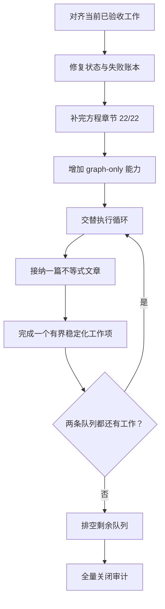
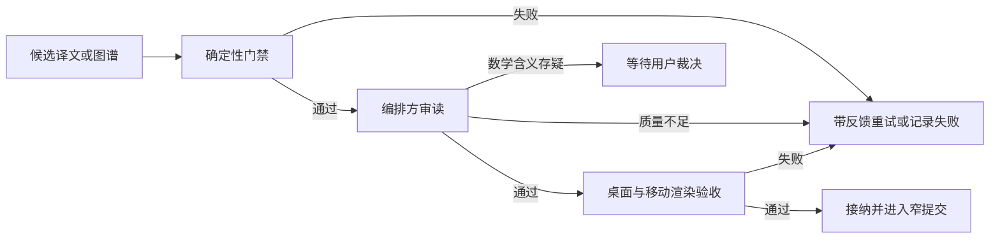

# Algebrica 翻译稳定化与不等式扩展 - Plan

## Goal Capsule

- **Objective:** 先交付已验收的本地译文并补完方程章节，再交替治理旧文质量债与翻译不等式章节，最终让目标范围内的内容、LaTeX 拓扑、知识图谱和状态账本同时可信。
- **Authority hierarchy:** 用户在本次会话确认的交替推进策略 > `.agents/skills/algebrica-translation-supervisor/SKILL.md` > 本计划 > `docs/plans/2026-07-21-001-feat-algebrica-zh-replica-site-plan.md`。
- **Stop conditions:** OMP 调用没有获得紧邻调用的用户确认；候选译文涉及原文数学含义修正；推送未获单独授权；工作将扩展到不等式之后的章节；上游变化使状态基线或目标清单失效。
- **Execution profile:** 每次 OMP 调用只处理一篇文章或一个知识图谱。候选产物必须逐项通过门禁后才能入库。
- **Tail ownership:** 执行者负责清理失败尝试产生的临时产物，并在获准的交付边界内保持提交历史线性。提交与推送是两个独立权限门。

---

## Product Contract

### Summary

本阶段把翻译工程从“持续产出文章”收敛为两条可交替执行的工作流。扩展流补完方程章节并完成 14 篇不等式文章。稳定化流清理现有 42 篇严格 LaTeX 拓扑失败、补齐当前文章缺失的 30 个中文知识图谱，并修复状态账本失真。两条工作流共享同一套逐篇接纳门禁，阶段终点是不等式章节完成且稳定化队列清零。

### Problem Frame

当前仓库已有 90 篇 current 译文，但交付状态与质量状态尚未收敛。`main` 相对 `origin/main` 领先两个提交，工作区还有四篇已验收文章和共享知识图谱改动。方程章节剩两篇，不等式章节尚未开始。严格 LaTeX 拓扑全量审计报告 42 篇失败，85 篇拥有上游知识图谱的 current 文章中有 30 篇缺少中文图谱。失败账本还保留两条已经成功翻译的历史记录。若只继续扩张文章数量，后续验收成本与状态歧义会继续累积。

### Requirements

**交付与状态**

- R1. 保留工作区现有改动，并按文章边界交付四篇已验收译文及其知识图谱变更。
- R2. 提交、合并到 `main` 与推送保持独立权限门，任何交付都不得改写无关历史或混入无关文件。
- R3. `translation-status`、译文文件和 `translation-failures.json` 必须对 current、stale、missing 与失败状态给出一致结论。

**章节扩展**

- R4. 方程章节剩余的两篇参数方程文章必须逐篇通过完整接纳门禁，使该章节达到 22/22。
- R5. 不等式章节的 14 篇上游可用文章必须逐篇通过完整接纳门禁，使该章节达到 14/14。
- R6. 稳定化队列与不等式队列必须交替推进，任何一条队列都不得长期停滞。

**质量债**

- R7. 当前 42 篇严格 LaTeX 拓扑失败必须逐篇分类和修复，最终全量严格审计不得保留例外。
- R8. 每篇 current 文章只要上游存在知识图谱，就必须有结构等价的中文知识图谱。
- R9. 知识图谱补译不得改写已经接纳的文章 Markdown。
- R10. 若修复需要改变原文数学含义、定义域、推导或符号关系，执行必须停止并交由用户裁决。

**接纳与验证**

- R11. 每篇文章或图谱候选必须通过确定性校验、编排方审读和渲染验收后才能入库。
- R12. 每次 `scripts/translate.mjs` 候选生成调用都必须紧邻一次用户明确授权；同一次调用的内部有限重试包含在该授权内，反馈重译属于新的调用，持续授权不得替代该调用级权限门。
- R13. 阶段完成时，状态必须达到 current 106、stale 0、missing 142；其中 12 篇 missing 必须明确归因于上游缺失。

### Scope Boundaries

**本阶段包含**

- 当前已验收但尚未完整交付的四篇方程文章及其共享知识图谱改动。
- 方程章节剩余两篇文章。
- 不等式章节全部 14 篇文章。
- 当前 42 篇严格 LaTeX 拓扑失败。
- 当前 30 篇缺少中文版本的知识图谱。
- `translation-failures.json` 与 current 状态的交叉校验。
- 为安全补译知识图谱增加单篇 `--graph-only` 能力。

**延后处理**

- 线性代数、数列、函数及不等式之后的其他章节。
- 上游当前缺失的 12 篇文章；上游补齐后再重新规划。
- 与本阶段门禁无关的站点重构、视觉改版或性能优化。

**不属于本阶段**

- 切换 OMP 模型或供应商。
- 批量自动接纳模型产物。
- 未经用户裁决而修正上游数学内容。
- 以例外清单绕过严格 LaTeX 拓扑失败。

### Acceptance Examples

- AE1. 执行者交付现有四篇已验收文章时，只包含对应译文和各自知识图谱条目，不改变正文内容或无关图谱条目。覆盖 R1、R2。
- AE2. 执行者为一篇旧文运行图谱补译后，该文章 Markdown 的字节内容保持不变，只有对应中文图谱条目发生变化。覆盖 R8、R9、R11。
- AE3. LaTeX 修复发现源文公式自身存在数学疑点时，执行者保留候选状态并请求用户裁决，不把语义修正混入排版修复。覆盖 R7、R10。
- AE4. 一篇旧文完成拓扑修复后，单篇严格审计通过，桌面与移动端公式均正确换行和居中，浏览器控制台无渲染错误。覆盖 R7、R11。
- AE5. 阶段终检报告方程 22/22、不等式 14/14、current 106、stale 0、missing 142，并且全量拓扑和知识图谱覆盖检查通过。覆盖 R4、R5、R8、R13。

---

## Planning Contract

### Key Technical Decisions

- KTD1. 采用双队列交替推进。两条队列都有工作时，以“一篇不等式候选 + 一个稳定化工作项”为基本节奏；一个稳定化工作项是修复一篇旧文的拓扑或补译一个旧文图谱。一条队列清零后，继续排空另一条队列。(session-settled: user-directed — chosen over 暂停全部新翻译直到旧债清零: 用户要求在治理旧债时继续保持翻译进度)
- KTD2. 文章或单个知识图谱是最小模型调用与接纳单位。不得使用批量模型输出替代逐项审读。实现 R5、R8、R11、R12。
- KTD3. 严格 LaTeX 拓扑审计采用零例外完成标准。源文数学异常走 R10，不进入宽松 allowlist。实现 R7。
- KTD4. 在 `scripts/translate.mjs` 增加 `--graph-only`，复用现有模型、校验和图谱写入路径。独立脚本会复制模型重试、反馈和原子写入语义，容易与文章翻译漂移，因此不采用。实现 R8、R9、R12。
- KTD5. `scripts/translation-status.mjs --verify` 必须交叉检查失败账本。current 目标仍出现在 `translation-failures.json` 时，验证失败并报告冲突；missing 或 stale 目标可以保留真实失败记录。实现 R3。
- KTD6. 交付保持一篇文章或一个旧文图谱补译对应一个逻辑提交。共享的 `src/data/article-graphs-zh.json` 只纳入该目标的条目，推送遵循 R2。
- KTD7. 视觉门禁覆盖 1440×900 桌面视口与 390×844 移动视口。桌面必须显示知识图谱；移动端沿用上游 `no-mobile` 行为，不把隐藏图谱判为缺陷。实现 R8、R11。
- KTD8. `.agents/skills/algebrica-translation-supervisor/SKILL.md` 是模型委托与接纳流程的规范来源。本计划只记录本阶段增量约束。实现 R10、R11、R12。

### High-Level Technical Design

阶段流按依赖和交替节奏推进：

文章与知识图谱使用同一接纳状态机：

### Output Structure

- `content-zh/equations/` 保存方程章节译文及旧文修复。
- `content-zh/inequalities/` 新增 14 篇不等式译文。
- `content-zh/{sets-and-numbers,algebraic-structures,powers-radicals-logarithms,complex-numbers,trigonometry,polynomials}/` 保存对应旧文的 LaTeX 拓扑修复。
- `src/data/article-graphs-zh.json` 保存中文知识图谱，条目结构继续由 `src/lib/article-graphs.mjs` 读取和合并。
- `scripts/translate.mjs` 承载文章翻译与新增的单篇图谱补译入口。
- `scripts/translation-status.mjs` 承载状态与失败账本一致性验证。
- `scripts/check-article-graph-coverage.mjs` 承载 current 文章的中文图谱覆盖终检。
- `translation-failures.json` 只保留真实、尚未解决的失败。
- `tests/unit/translation-prompt.test.mjs`、`tests/unit/article-graph.test.mjs` 和新增的 `tests/unit/translation-status.test.mjs` 覆盖本阶段管线变化。

### Assumptions

- `zhipu-coding-plan/glm-5.2` 继续作为 `scripts/translate.mjs` 中固定的 OMP 模型。
- 上游文章与知识图谱结构在本阶段执行期间保持兼容；每次执行前仍由状态校验确认。
- 当前 working tree 中的四篇未跟踪方程译文和图谱改动已经通过此前门禁，不需要重新调用模型。
- 近期同一工作区已通过 127 个测试、259 页强制构建与目标页面视觉验收；这些结果只作为计划基线，执行时必须按 Verification Contract 重新取证。

### Sequencing

1. U1 对齐当前已验收工作，避免后续管线修改与内容交付混在同一差异中。
2. U2 让状态和失败账本成为可信基线。
3. U3 完成方程章节后，U4 再修改翻译脚本，避免候选生成期间改变共享执行入口。
4. U4 完成后，U5、U6、U7 与 U8 进入交替循环。每完成一篇 U8 文章，至少完成一个来自 U5、U6 或 U7 的稳定化工作项。
5. 所有单元完成后执行 Verification Contract 的全量关闭审计。

---

## System-Wide Impact

- **命令接口:** `scripts/translate.mjs` 新增模式，但现有单篇、`--all-missing`、`--dry-run` 和 `--feedback-file` 行为不得回归。参数冲突必须在 OMP 调用前失败。
- **持久状态:** `content-zh/`、`src/data/article-graphs-zh.json` 和 `translation-failures.json` 是三个独立写入面。任一候选失败都不得留下只更新其中一部分的状态。
- **状态派生:** `scripts/translation-status.mjs` 继续从上游源、译文 hash 和 `sections.yaml` 派生三态，只把失败账本作为一致性断言，不把它升级为第二个状态真源。
- **共享工作区:** 图谱补译和文章翻译都修改共享 JSON。执行者必须在每次调用前重新读取目标条目和 working tree，发现并发或无关变化时停止写入。
- **人工边界:** OMP 只生成候选。编排方持有接纳权，用户持有逐次外部模型授权、数学语义裁决和推送权限。
- **恢复语义:** 每个已接纳文章或图谱都是恢复检查点。模型失败、验收拒绝或会话中断后，从下一个未接纳目标继续，不重跑或覆盖已经接纳的目标。

---

## Implementation Units

### U1. 对齐并交付当前已验收内容

**Goal:** 在不改变已验收内容的前提下，把当前四篇方程译文和对应知识图谱变更整理为可独立交付的逻辑单元。

**Requirements:** R1、R2、R11。

**Dependencies:** 无。

**Files:**

- `content-zh/equations/logarithmic-equations.md`
- `content-zh/equations/homogeneous-trigonometric-equations.md`
- `content-zh/equations/trigonometric-equations.md`
- `content-zh/equations/equations-with-parameters.md`
- `src/data/article-graphs-zh.json`

**Approach:**

- 先核对 working tree、`main` 与 `origin/main` 的差异，保留全部无关状态。
- 复用已有验收证据，并确认文件自验收后未发生变化。
- 按 KTD6 拆分文章与对应图谱条目。提交、合并和推送分别遵守 R2。

**Test Scenarios:**

- 四篇文章的 diff 与已验收候选一致。
- 每个逻辑交付单元只包含一篇文章及其对应图谱条目。
- `src/data/article-graphs-zh.json` 仍可解析，且无关条目字节内容不变。

**Verification:**

- 对四篇文章分别执行单篇翻译校验与严格 LaTeX 拓扑审计。
- 检查窄差异和提交边界；只有获准时才检查远端同步结果。

### U2. 修复状态与失败账本一致性

**Goal:** 让验证命令主动发现 current 文章仍被记为失败的矛盾状态。

**Requirements:** R3、R13。

**Dependencies:** U1。

**Files:**

- `scripts/translation-status.mjs`
- `translation-failures.json`
- `tests/unit/translation-status.test.mjs`

**Approach:**

- 在 `--verify` 路径读取失败账本，并把 section/slug 规范化为与状态索引一致的键。
- 把状态收集与账本检查提取为可导入函数，并用直接执行保护保持现有 CLI 行为。
- current 目标仍在失败账本中时，输出具体冲突并以失败退出。missing 或 stale 的真实失败按 KTD5 保留。
- 删除已经 current 的 `algebraic-structures/groups` 与 `algebraic-structures/rings` 历史记录。
- 账本缺失、格式错误或重复记录必须给出确定且可测试的行为。

**Test Scenarios:**

- current 目标出现在失败账本时，`--verify` 失败并报告目标。
- 真实 missing 失败记录继续保留并可被报告。
- stale 目标的最近失败记录不会被错误清除。
- 删除两条历史记录后，现有仓库的 `--verify` 通过。
- 格式错误的失败账本不会被静默忽略。

**Verification:**

- 运行新增状态测试。
- 运行完整单元测试与 `node scripts/translation-status.mjs --verify`。

### U3. 补完方程章节

**Goal:** 翻译并接纳方程章节剩余两篇文章，使章节达到 22/22。

**Requirements:** R4、R10、R11、R12。

**Dependencies:** U1、U2。

**Files:**

- `content-zh/equations/linear-equations-with-parameters.md`
- `content-zh/equations/quadratic-equations-with-parameters.md`
- `src/data/article-graphs-zh.json`

**Approach:**

- 按 KTD2 和 KTD8 逐篇调用 OMP、评审、修订和接纳。
- 每次调用前执行 R12 的权限门。
- 若严格拓扑或审读发现源文数学疑点，执行 R10。

**Test Scenarios:**

- 每篇文章的 frontmatter、链接、图片、公式和知识图谱结构都与英文源匹配。
- 参数条件、定义域、分类讨论与原文数学含义一致。
- 方程章节状态达到 22/22，且不产生 stale 或失败账本残留。

**Verification:**

- 对每篇文章执行单篇确定性校验、严格拓扑审计和双视口渲染验收。
- 完成两篇后运行章节状态检查和强制构建。

### U4. 增加安全的单篇知识图谱补译模式

**Goal:** 支持只翻译一个已接纳文章的知识图谱，并保证文章正文不被触碰。

**Requirements:** R8、R9、R11、R12。

**Dependencies:** U2、U3。

**Files:**

- `scripts/translate.mjs`
- `tests/unit/translation-prompt.test.mjs`
- `tests/unit/article-graph.test.mjs`

**Approach:**

- 增加 `--graph-only <section>/<slug>` 参数，并复用现有 `translateArticleGraph()` 与图谱校验路径。
- 写入前验证文章 current、上游图谱存在、中文图谱缺失或处于明确反馈重试。
- 采用内存构造后原子写入，模型或校验失败时保持 JSON 不变。
- `--dry-run` 只报告目标和前置条件，不调用模型或写文件。
- 拒绝 `--graph-only` 与 `--all-missing` 等歧义组合，并在参数测试中固定错误语义。

**Test Scenarios:**

- 成功补译只新增目标图谱条目，文章 Markdown 保持字节一致。
- 上游图谱缺失时，在 OMP 调用前失败。
- 已有中文图谱时默认无操作，不覆盖已接纳内容。
- `--feedback-file` 只对目标图谱生成反馈候选，并且每次反馈重译重新执行 R12。
- `--dry-run` 不调用模型且不修改文件。
- 模型失败、无效 JSON 或结构校验失败时，图谱文件不变。
- 目标图谱在读取后被其他工作修改时，本次写入停止，不覆盖新状态。

**Verification:**

- 运行翻译 prompt 与图谱单元测试。
- 用一个缺失图谱的 current 目标执行 dry-run，并核对零差异。

### U5. 治理三角函数与复数的高密度 LaTeX 拓扑债

**Goal:** 修复三角函数 16 篇和复数 7 篇的严格 LaTeX 拓扑失败。

**Requirements:** R7、R10、R11。

**Dependencies:** U2。

**Files:**

- `content-zh/trigonometry/*.md`
- `content-zh/complex-numbers/*.md`

**Approach:**

- 以单篇审计输出为准，对定界符、环境、换行 `\\`、对齐和块级结构逐项比对。
- 只修复格式拓扑和由翻译引入的结构漂移，不借机重写文案。
- 每篇通过后立即记录验证结果；数学含义疑点执行 R10。
- 目标清单见 Appendix A。

**Test Scenarios:**

- 多行公式的行数、换行符和对齐环境与英文源一致。
- 行内公式不会因修复变成块级公式，反之亦然。
- 桌面与移动视口没有水平溢出、错误换行或非预期左对齐。

**Verification:**

- 对 23 篇逐篇运行严格拓扑审计和目标页面视觉验收。
- 本单元结束时，这两个章节在全量审计中为零失败。

### U6. 治理其余 LaTeX 拓扑债

**Goal:** 修复多项式、方程、代数结构、对数和模运算共 19 篇严格 LaTeX 拓扑失败。

**Requirements:** R7、R10、R11。

**Dependencies:** U2。

**Files:**

- `content-zh/polynomials/*.md`
- `content-zh/equations/*.md`
- `content-zh/algebraic-structures/*.md`
- `content-zh/powers-radicals-logarithms/logarithms.md`
- `content-zh/sets-and-numbers/modulo-operator.md`

**Approach:**

- 沿用 U5 的单篇审计与接纳模式。
- 优先处理方程章节，避免 U3 新增内容与旧债关闭状态分离。
- 目标清单见 Appendix A。

**Test Scenarios:**

- 多项式长除、二项式展开与方程组的多行结构保持源文拓扑。
- 同构、环和群文章中的映射符号与环境边界不改变。
- 对数与模运算的行内和块级公式边界保持一致。

**Verification:**

- 对 19 篇逐篇运行严格拓扑审计和目标页面视觉验收。
- 本单元结束时，所有旧章节在全量审计中为零失败。

### U7. 补齐旧文中文知识图谱

**Goal:** 为当前缺失中文图谱的 30 篇旧文补齐结构等价的本地化图谱。

**Requirements:** R8、R9、R10、R11、R12。

**Dependencies:** U4。

**Files:**

- `src/data/article-graphs-zh.json`
- `scripts/check-article-graph-coverage.mjs`
- `tests/unit/article-graph-coverage.test.mjs`

**Approach:**

- 使用 U4 的 `--graph-only` 模式逐篇处理 Appendix B 清单。
- 每个图谱调用遵循 KTD2、KTD7 和 KTD8。
- 保持节点顺序、连线关系、数值元数据与上游一致，只翻译可见文本。
- 每个图谱接纳前证明对应 Markdown 字节不变。
- 每个接纳图谱形成一个恢复检查点；重启后跳过已有中文条目，不重复调用 OMP。
- 增加动态覆盖检查，按 current 状态连接上游与中文图谱；检查不得硬编码当前文章或图谱数量。

**Test Scenarios:**

- 中文图谱的节点数、边数、顺序与数值字段和上游一致。
- 桌面端图谱可见，标签无截断或重叠到不可读。
- 移动端沿用 `no-mobile` 行为。
- 图谱补译不改变文章 Markdown。
- current 文章拥有上游图谱但缺少中文条目时，覆盖检查报告具体目标并失败。
- 上游没有图谱的 current 文章不会被误报。

**Verification:**

- 对每个图谱运行结构校验和桌面视觉验收。
- 运行全量图谱覆盖检查，确认每篇拥有上游图谱的 current 文章都有中文条目。

### U8. 完成不等式章节

**Goal:** 翻译并接纳不等式章节全部 14 篇文章。

**Requirements:** R5、R6、R10、R11、R12。

**Dependencies:** U2、U3、U4。

**Files:**

- `content-zh/inequalities/*.md`
- `src/data/article-graphs-zh.json`

**Approach:**

- 按 Appendix C 顺序逐篇执行 KTD2 和 KTD8。
- 每接纳一篇文章，下一工作项必须来自 U5、U6 或 U7，除非稳定化队列已经清零。
- 重点审读等价变形、不等号方向、解集边界、增根失根与定义域。

**Test Scenarios:**

- 不等式方向、开闭区间、并集与交集、定义域和解集与英文源一致。
- 分式、根式、指数、对数、绝对值和三角不等式的条件分支完整。
- 每篇图谱存在时都同步产生结构等价的中文图谱。
- 章节完成后状态为 14/14，且不产生 stale 或失败账本残留。
- 会话在任意文章后中断时，恢复过程从第一个 missing 目标继续，不覆盖 current 文章。

**Verification:**

- 对每篇文章执行单篇确定性校验、严格拓扑审计和双视口渲染验收。
- 章节完成后运行强制构建、渲染门禁和状态检查。

---

## Risks & Dependencies

- **外部模型质量波动:** OMP 候选可能在语言流畅度、术语或数学条件上退化。KTD2 与 R11 阻止候选自动入库。
- **共享图谱文件冲突:** 文章翻译与旧图谱补译都修改 `src/data/article-graphs-zh.json`。KTD6 要求按目标条目形成窄差异。
- **审计假阳性与源文缺陷:** 严格拓扑差异不等于可见缺陷，源文也可能含错误。R7 要求逐篇分类，R10 保留数学裁决权。
- **上游漂移:** 新增或修改的源文会改变 current/missing 计数。执行阶段先运行状态验证；若 R13 基线失效，则触发 Stop condition。
- **视觉验收成本:** 42 篇拓扑修复、30 个图谱和 16 篇新译文需要逐项证据。KTD1 把成本分散到交替循环，不能用抽检替代目标项门禁。
- **权限节奏:** R12 可能让模型调用等待用户。等待不授权批处理，也不允许绕过确认。

---

## Verification Contract

### 单篇文章门禁

- `node scripts/validate-translation.mjs <section>/<slug>` 退出码为 0。
- `node .agents/skills/algebrica-translation-supervisor/scripts/audit-latex-topology.mjs <section>/<slug>` 报告该目标通过。
- 编排方审读术语、中文表达、链接、图片、公式、定义域和推导条件。
- 1440×900 与 390×844 两个视口均无控制台错误、水平溢出或公式错位。
- 文章包含上游图谱时，桌面端中文图谱结构和标签通过验收。

### 管线变更门禁

- `node --test tests/unit/translation-prompt.test.mjs tests/unit/mask-restore.test.mjs tests/unit/validate.test.mjs` 当前基线为 59 个测试全部通过；新增测试后通过数只能增加。
- `node --test tests/unit/article-graph.test.mjs tests/unit/translation-status.test.mjs` 全部通过。
- `npm test` 当前基线为 127 个测试全部通过；新增测试后通过数只能增加。

### 阶段关闭门禁

- `npm run build -- --force` 成功，当前页面基线为 259 页；新增 16 篇译文不应改变路由总数。
- `node scripts/check-rendered-content.mjs` 成功。
- `node scripts/translation-status.mjs --verify` 成功，并报告 current 106、stale 0、missing 142。
- `node .agents/skills/algebrica-translation-supervisor/scripts/audit-latex-topology.mjs --all` 报告 106 通过、0 失败。
- `node scripts/check-article-graph-coverage.mjs` 成功，并确认每篇拥有上游图谱的 current 文章都有中文图谱条目。
- `translation-failures.json` 不包含任何 current 或 stale 目标。
- 获准交付时，`main` 历史保持线性，工作区不含本阶段遗留的临时文件或未解释改动。

---

## Definition of Done

- R1–R13 均有可追溯的验证证据。
- 方程章节达到 22/22，不等式章节达到 14/14。
- 翻译状态达到 current 106、stale 0、missing 142；12 篇上游缺失目标被单独标记。
- 106 篇 current 译文全部通过严格 LaTeX 拓扑审计，零例外。
- 每篇拥有上游知识图谱的 current 文章都有结构等价的中文图谱。
- `translation-failures.json` 与状态索引一致，不含已成功目标。
- 所有新增或修改文章完成确定性、审读和双视口验收。
- 全量测试、强制构建、渲染门禁、状态验证和覆盖检查全部通过。
- 候选文件、预览进程、临时反馈文件和失败尝试代码均已清理。
- 若用户未授权提交或推送，执行停在已验证且边界清晰的 prepared state，不擅自扩大权限。

---

## Sources / Research

- `.agents/skills/algebrica-translation-supervisor/SKILL.md`：现行 OMP 委托、逐篇接纳、数学裁决和交付规范。
- `docs/plans/2026-07-21-001-feat-algebrica-zh-replica-site-plan.md`：原始站点与翻译流水线的产品契约和 KTD9。
- `scripts/translate.mjs`：现有单篇翻译、图谱翻译、反馈重试和失败账本路径。
- `scripts/translation-status.mjs`：current、stale、missing 状态真源与验证入口。
- `.agents/skills/algebrica-translation-supervisor/scripts/audit-latex-topology.mjs`：严格 LaTeX 拓扑审计入口。
- `src/lib/article-graphs.mjs` 与 `src/components/ArticleGraph.astro`：知识图谱合并逻辑和桌面/移动显示契约。

---

## Appendix

### Appendix A. 严格 LaTeX 拓扑债清单

**三角函数（16）**

- `trigonometry/angles-and-angular-measure`
- `trigonometry/arcsine-and-arccosine`
- `trigonometry/arctangent-and-arccotangent`
- `trigonometry/hyperbolic-identities`
- `trigonometry/hyperbolic-secant-and-cosecant`
- `trigonometry/hyperbolic-tangent-and-cotangent`
- `trigonometry/law-of-cosines`
- `trigonometry/law-of-sines`
- `trigonometry/pythagorean-identity`
- `trigonometry/pythagorean-theorem`
- `trigonometry/reduction-formulas-and-reference-angles`
- `trigonometry/secant-and-cosecant`
- `trigonometry/sine-and-cosine`
- `trigonometry/tangent-and-cotangent`
- `trigonometry/trigonometric-identities`
- `trigonometry/unit-circle`

**复数（7）**

- `complex-numbers/complex-logarithm`
- `complex-numbers/complex-number-fundamental-inequalities`
- `complex-numbers/complex-number-operations`
- `complex-numbers/complex-numbers-exponential-form`
- `complex-numbers/complex-numbers-trigonometric-form`
- `complex-numbers/de-moivre-theorem`
- `complex-numbers/roots-of-unity`

**多项式（8）**

- `polynomials/binomial-theorem`
- `polynomials/binomials`
- `polynomials/factoring-polynomials-ac-method`
- `polynomials/monomials`
- `polynomials/multiplying-polynomials`
- `polynomials/notable-products`
- `polynomials/synthetic-division`
- `polynomials/trinomials`

**方程（6）**

- `equations/binomial-equations`
- `equations/geometric-interpretation-quadratic-equations`
- `equations/loss-of-roots`
- `equations/polynomial-equations`
- `equations/quadratic-formula`
- `equations/trinomial-equations`

**代数结构（3）**

- `algebraic-structures/groups`
- `algebraic-structures/homomorphisms-and-isomorphisms`
- `algebraic-structures/rings`

**其他（2）**

- `powers-radicals-logarithms/logarithms`
- `sets-and-numbers/modulo-operator`

### Appendix B. 旧文中文知识图谱补译清单

**集合与数（14）**

- `sets-and-numbers/sets`
- `sets-and-numbers/types-of-numbers`
- `sets-and-numbers/natural-numbers`
- `sets-and-numbers/integers`
- `sets-and-numbers/modulo-operator`
- `sets-and-numbers/rational-numbers`
- `sets-and-numbers/irrational-numbers`
- `sets-and-numbers/real-numbers`
- `sets-and-numbers/properties-of-real-numbers`
- `sets-and-numbers/absolute-value`
- `sets-and-numbers/intervals`
- `sets-and-numbers/supremum-and-infimum`
- `sets-and-numbers/factorial`
- `sets-and-numbers/binomial-coefficient`

**代数结构（6）**

- `algebraic-structures/groups`
- `algebraic-structures/rings`
- `algebraic-structures/fields`
- `algebraic-structures/vector-spaces`
- `algebraic-structures/modules`
- `algebraic-structures/homomorphisms-and-isomorphisms`

**幂、根式与对数（3）**

- `powers-radicals-logarithms/powers`
- `powers-radicals-logarithms/radicals`
- `powers-radicals-logarithms/logarithms`

**复数（6）**

- `complex-numbers/complex-numbers`
- `complex-numbers/complex-number-operations`
- `complex-numbers/complex-numbers-trigonometric-form`
- `complex-numbers/euler-formula`
- `complex-numbers/complex-numbers-exponential-form`
- `complex-numbers/de-moivre-theorem`

**概率（1）**

- `probability/median-and-quantiles`

### Appendix C. 不等式章节目标清单

- `inequalities/inequalities`
- `inequalities/polynomial-inequalities`
- `inequalities/linear-inequalities`
- `inequalities/quadratic-inequalities`
- `inequalities/geometric-interpretation-quadratic-inequalities`
- `inequalities/sign-analysis-in-inequalities`
- `inequalities/rational-inequalities`
- `inequalities/irrational-inequalities`
- `inequalities/exponential-inequalities`
- `inequalities/logarithmic-inequalities`
- `inequalities/inequalities-with-absolute-value`
- `inequalities/trigonometric-inequalities`
- `inequalities/loss-of-solutions-in-inequalities`
- `inequalities/systems-of-inequalities`
