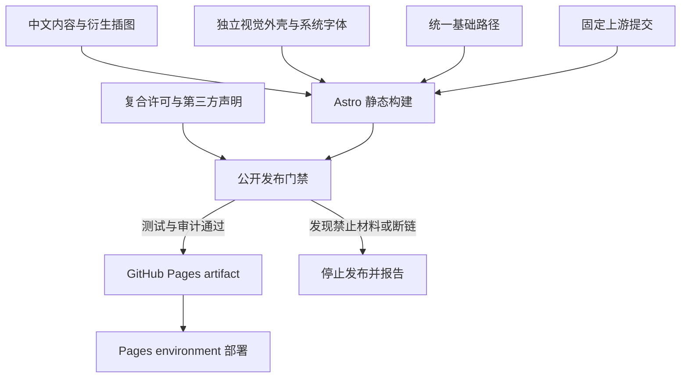

# Algebrica 中文公开仓库发布加固 - Plan

## Goal Capsule

- **Objective:** 将当前私人复刻站改造为可公开审阅和通过 GitHub Pages 发布的非商业中文译本，同时建立清晰的内容、代码和第三方材料许可边界。
- **Authority hierarchy:** 本次会话已确认的独立视觉外壳与 JavaScript 保留策略 > 本计划 > 现有复刻站计划中关于逐字复制主题和视频的决定。
- **Stop conditions:** 无法确认某个拟保留资产的来源或许可；GitHub Pages 项目子路径会破坏文章、搜索、公式、插图或知识图谱；改造需要改变数学内容或翻译状态；发布目标不再是公开、非商业站点。
- **Execution profile:** 先建立资产与许可门禁，再替换视觉外壳，然后完成子路径兼容、持续集成和桌面/移动端视觉验收。
- **Tail ownership:** 实施者负责删除失败尝试和不再使用的复刻资产，并准备经过审计的公开历史。历史重写、强制推送、仓库可见性变更和 GitHub Pages 设置属于独立外部动作，不由本计划的代码提交自动完成。

---

## Product Contract

### Summary

本工作保留中文数学内容、文章结构、公式渲染、插图、搜索和知识图谱。站点改用独立视觉外壳和系统字体栈。仓库明确区分本站代码、CC BY-NC 4.0 内容以及第三方依赖。GitHub Actions 在公开仓库中验证并发布静态站点，但不会引入分析、广告或远程字体服务。

### Problem Frame

当前实现以私人非商业复刻为前提。`public/theme/` 保存了原站主题 CSS、字体和图标，`public/media/` 保存了原站首页视频，`reference/` 保存了原站完整 HTML 快照。`scripts/fetch-assets.mjs` 会重新下载这些材料。`src/pages/about.astro` 也明确承认主题权利不属于本项目。该边界不适合直接公开仓库。

翻译内容和由原图改编的中文插图可以按原项目声明的 CC BY-NC 4.0 条件分享，但必须署名、链接许可、标明修改并保持非商业用途。本站自主编写的代码需要单独的软件许可。现有 Astro、Markdown、MathJax、搜索和知识图谱实现具有明确功能价值，直接依赖均声明了许可证，全面替换 JavaScript 不会降低主要版权风险。

### Requirements

**许可与来源**

- R1. 仓库必须用独立文件说明本站代码、翻译内容、改编插图和第三方材料各自适用的许可，不得用单一软件许可证暗示全部内容均为开源软件。
- R2. README、About 页面和文章页尾必须署名 Antonio Lupetti 与 Algebrica，链接原文和 CC BY-NC 4.0，并说明本站是非官方中文译本且包含翻译和视觉改动。
- R3. 公开版本不得跟踪原站主题 CSS、原站标志、首页视频、自托管原站字体或完整页面抓取快照。
- R4. 公开版本必须保留中文译文和改编插图的来源信息，并将这些材料标记为 CC BY-NC 4.0 衍生内容。

**独立视觉外壳**

- R5. 页面必须使用本站独立的布局、颜色、间距、组件命名和文字标识，不再以原站 DOM 与 CSS class 契约作为视觉真源。
- R6. 字体必须先使用无需分发字体文件的跨平台系统字体栈；只有在视觉验收证明系统字体不可接受时，才可另行评估具有明确 OFL 许可的字体。
- R7. 首页、分类页、文章页、静态页、桌面导航和移动导航必须保持当前信息架构与可访问的交互能力。
- R8. 公式、插图、表格和知识图谱必须在独立视觉外壳中保持现有渲染与响应式行为。

**JavaScript 与隐私**

- R9. 保留具有明确用途和许可证的 Astro、Markdown、YAML、MathJax、KaTeX、rehype 与 remark 依赖；只删除未使用、来源不明或不再需要的依赖。
- R10. 仓库必须维护第三方许可证清单，并让门禁发现缺失许可证、未记录的直接依赖和禁止材料。
- R11. 构建产物不得包含分析、广告、远程字体、原站 WordPress 脚本或其他非必要的第三方运行时请求。

**GitHub Pages 发布**

- R12. 本地根路径和 GitHub Pages 项目子路径必须共享同一套路径生成规则，站内链接、搜索、样式、插图和知识图谱资源不得硬编码到域名根目录。
- R13. GitHub Actions 必须在发布前运行测试、公开发布门禁和生产构建，并且只在 `main` 推送或人工触发时部署 Pages。
- R14. 发布门禁必须遍历静态构建产物，验证内部链接和资源引用可解析，并确认禁止的主机、脚本和资产不存在。
- R15. 本地和持续集成必须通过同一配置解析上游 Algebrica 内容目录；持续集成必须检出并验证固定的上游提交，不得隐式跟随上游 `main`。
- R16. 仓库变为公开前，所有可达分支和标签的 Git 历史都不得包含 R3 禁止材料或已识别的凭据；当前工作树清理不得替代历史审计。

### Key Decisions

- **独立视觉外壳。** (session-settled: user-directed — chosen over 保留相似布局并重写 CSS: 独立视觉可以形成更清晰的权利边界) Governs R3, R5, R6, R7, R8.
- **保留许可证清晰的 JavaScript 依赖。** (session-settled: user-approved — chosen over 全面替换 JavaScript: 当前依赖承担构建、公式、内容处理和搜索功能，主要风险来自复制视觉资产) Governs R9, R10, R11.

### Acceptance Examples

- AE1. 读者打开首页时，看到本站文字标识、独立导航和章节索引，不会加载原站标志、视频、字体或主题 CSS。覆盖 R3、R5、R6、R7。
- AE2. 读者从 GitHub Pages 项目子路径打开分类页，再进入文章页时，样式、站内链接、插图、公式和知识图谱均可正常加载。覆盖 R8、R12、R14。
- AE3. 读者查看文章页尾和仓库许可说明时，可以区分本站代码许可、原作内容许可、翻译改动和第三方依赖。覆盖 R1、R2、R4、R10。
- AE4. 维护者新增直接依赖但未更新第三方许可证清单时，持续集成明确失败并报告依赖名称。覆盖 R9、R10、R13。
- AE5. 构建产物出现 `googletagmanager.com`、原站 WordPress 主题路径或被禁文件时，公开发布门禁明确失败。覆盖 R3、R11、R14。
- AE6. 持续集成缺少上游内容、上游提交不匹配或内容路径无效时，构建在发布 job 前明确失败。覆盖 R13、R15。
- AE7. 预发布历史审计在旧提交中发现原站主题、视频、字体、完整 HTML 或凭据时，公开化停止，直至隔离副本中的历史清理和复核通过。覆盖 R3、R16。

### Success Criteria

- Git 跟踪文件中不再存在 `public/theme/`、`public/media/` 和 `reference/*.html`。
- 生产构建中的内部链接和资源检查为零缺失。
- 生产构建中的禁止主机、远程字体和分析脚本检查为零命中。
- 所有直接依赖都在第三方许可证清单中，并且锁文件中的包不存在缺失许可证字段。
- 持续集成从 `antoniolupetti/algebrica` 检出固定提交，并且该提交与仓库记录的上游版本一致。
- 所有可达 Git 历史中的禁止材料和已识别凭据检查为零命中。
- 首页、一个分类页、一篇含多行公式和插图的文章、一篇含知识图谱的文章以及一个静态页通过桌面与移动端视觉验收。

### Scope Boundaries

**Included**

- 删除或替换复制主题、原站品牌资产、视频、字体和完整 HTML 快照。
- 重写站点外壳、首页 hero、导航、搜索控件样式和文章视觉系统。
- 建立复合许可、署名、第三方声明和自动化门禁。
- 支持 GitHub Pages 项目子路径并增加发布工作流。
- 更新与旧复刻视觉契约冲突的测试和文档。

**Deferred**

- 自定义域名和 DNS 配置。
- OFL Web 字体引入。
- 对原项目名称或标志的商标法律意见。
- 商业托管、赞助、广告或其他可能改变 CC BY-NC 适用判断的用途。

**Outside this product's identity**

- 恢复原站像素级视觉复刻。
- 恢复原站账号、分析、阅读量、广告或 WordPress 运行时。
- 将 CC BY-NC 4.0 内容重新许可为 MIT 或其他软件许可证。

### Dependencies

- 内容权利边界依赖原项目的 CC BY-NC 4.0 声明。本计划提供工程风险控制，不构成法律意见。
- GitHub Pages 项目站点需要已知的 GitHub 用户名和仓库名。实现应通过构建配置注入该信息，不在业务组件中散布常量。
- 当前已验证的上游提交为 `66b40a8f19a727d619ef324a9ee6a6b1c6299638`。实现必须把该值放入单一配置文件。更新上游时，翻译状态和完整门禁必须一起重跑。

---

## Planning Contract

### Key Technical Decisions

- KTD1. **用本站语义化设计令牌和组件类替换复制主题。** (session-settled: user-directed — chosen over 保留相似布局并重写 CSS: 独立视觉可以形成更清晰的权利边界) 新样式由 `src/styles/site.css` 统一维护。视觉方向为中文数学参考书：纸张色背景、深色正文、单一低饱和蓝色强调色和紧凑章节目录。禁止渐变、功能卡片网格、装饰图标和图库 hero。模板只保留内容语义和可访问性结构。实现 R3、R5、R7、R8。
- KTD2. **使用系统字体栈作为首发方案。** 中文正文使用系统衬线栈，界面和代码使用系统无衬线与等宽栈。仓库不分发字体文件，也不请求远程字体服务。实现 R6、R11。
- KTD3. **保留现有功能性 JavaScript 依赖并建立许可证门禁。** (session-settled: user-approved — chosen over 全面替换 JavaScript: 当前依赖承担构建、公式、内容处理和搜索功能，主要风险来自复制视觉资产) `package-lock.json` 是依赖版本和许可证审计输入。门禁要求直接依赖进入 `THIRD_PARTY_NOTICES.md`，并报告锁文件缺失或未认可的许可证。MPL 或 LGPL 构建期传递依赖需要记录，但不会仅因许可证类别自动删除。实现 R9、R10。
- KTD4. **采用复合许可结构。** `LICENSES/MIT.txt` 适用于本站原创代码。`LICENSES/CC-BY-NC-4.0.txt` 适用于翻译内容和标记为衍生的插图。根 `LICENSE.md`、`README.md` 与 `THIRD_PARTY_NOTICES.md` 解释边界，避免 GitHub 的单一许可证标签替代实际范围说明。实现 R1、R2、R4、R10。
- KTD5. **删除原站抓取能力中的视觉资产分支。** `scripts/fetch-assets.mjs` 不再下载主题、字体、标志、视频或完整 HTML。若章节元数据仍需同步，应拆成仅获取结构化内容的脚本，并只保存必要字段和来源 URL。实现 R3、R4、R11。
- KTD6. **集中处理 GitHub Pages 基础路径。** `astro.config.mjs` 配置 `site` 和 `base`。模板、搜索索引、rehype 链接重写和资源 URL 通过一个路径辅助模块消费 Astro 基础路径，保证前缀只添加一次。实现 R12。
- KTD7. **使用 GitHub Actions 发布 Astro 静态产物。** 工作流使用最小权限 `contents: read`、`pages: write` 和 `id-token: write`，通过 GitHub Pages environment 部署。所有 Action 必须固定到完整提交 SHA，并以注释标注对应版本。Dependabot 负责提出 Action 更新。测试和构建失败时不得上传可部署产物。实现 R13、R14。
- KTD8. **公开发布门禁同时检查源树和构建产物。** 源树检查禁止复制资产、完整抓取快照和未记录直接依赖。构建产物检查链接、资源、禁止主机和第三方运行时请求。实现 R3、R10、R11、R14。
- KTD9. **集中配置并固定上游内容源。** `src/lib/upstream-source.mjs` 解析 `ALGEBRICA_SOURCE_DIR`，本地默认值为 `../algebrica`。持续集成把上游仓库检出到工作区内目录，并以 `upstream-lock.json` 固定仓库 URL 和提交 `66b40a8f19a727d619ef324a9ee6a6b1c6299638`。内容集合、静态页、SVG、图谱、数学检查和 slug 扫描都消费该模块或同一环境变量。实现 R4、R13、R15。
- KTD10. **移动端继续提供知识图谱。** 移除当前 `ArticleGraph.astro` 的 `no-mobile` 隐藏策略。移动端以纵向元数据摘要和可横向滚动的 SVG 画布呈现同一图谱，保留可访问名称，不将“桌面可见”作为功能完成标准。实现 R7、R8。
- KTD11. **在公开化前重写禁止材料的可达历史。** 使用隔离镜像执行路径定向的历史清理，并保留当前提交关系。清理后对全部分支和标签运行对象清单、禁止路径和凭据扫描。任何强制推送与仓库可见性变更都需要紧邻执行的外部动作确认。实现 R3、R16。

### High-Level Technical Design

### System-Wide Impact

- **内容渲染:** Markdown、MathJax SVG、插图重写和知识图谱数据模型保持不变。视觉 class 与布局结构会变化。
- **搜索:** `SearchBox.astro` 保留客户端搜索逻辑，但表单 action、索引 URL 和结果 URL 必须使用基础路径。
- **资源路径:** `BaseLayout.astro`、页面模板、rehype 重写器和静态 JSON 必须通过同一辅助模块生成路径。
- **构建:** GitHub Actions 需要可复现的 Node 与 npm 安装。`package-lock.json` 必须提交并使用 `npm ci`。
- **上游内容:** `src/content.config.ts`、`src/pages/bibliography.astro`、`src/pages/editorial-process.astro`、`src/lib/slug-map.mjs`、`src/lib/translation-index.mjs`、`scripts/sync-svg.mjs`、`scripts/sync-article-graphs.mjs` 和 `scripts/check-math.mjs` 当前分别硬编码 `../algebrica`。U3 必须消除这些分散入口。路径解析或提交验证失败必须在 Astro 收集内容前终止。
- **Git 历史:** 删除当前文件不会删除旧提交中的对象。U7 必须在隔离副本中清理全部可达引用，并把远端替换和公开化保留为独立动作。
- **翻译流程:** 翻译、术语、LaTeX 和知识图谱门禁不变。视觉验收基线从原站相似度改为本站设计一致性与可读性。
- **公开仓库:** `reference/*.html` 中的原站分析脚本、nonce 和完整页面内容不再公开。需要调试上游结构时使用不入库的临时抓取结果。

### Sequencing

1. 先完成 U1 的许可和资产清理边界，使后续工作无法重新引入禁止材料。
2. 完成 U2 的独立视觉外壳，并保留现有页面语义和功能。
3. 完成 U3 的基础路径和上游内容源改造，避免本地根路径成功但 Pages 项目路径或持续集成失败。
4. 完成 U4 的公开发布门禁和文档。
5. 完成 U5 的 GitHub Pages 工作流。
6. 运行 U6 的本地自动化与人工视觉验收。
7. 完成 U7 的历史清理预演和审计后，才允许执行远端历史替换、公开化和 Pages 设置。
8. 外部 cutover 完成后，运行 U8 的公开 URL 验收。

### Risks & Mitigations

- **混合许可被误读:** 根许可文件明确逐目录范围。README 首屏说明内容为非商业许可，代码许可不覆盖内容。
- **衍生插图来源丢失:** 每个已提交中文 SVG 通过清单映射到原始文章和源 URL。门禁拒绝没有来源记录的新衍生资产。
- **CSS 重写引发长公式或表格回归:** 先保留 MathJax 和内容结构，再用桌面与移动端样本验证溢出、居中和滚动行为。
- **GitHub Pages 子路径断链:** 路径辅助模块单元测试覆盖根路径、项目路径、尾斜杠和重复前缀。构建产物检查遍历全部内部引用。
- **持续集成缺少上游兄弟目录:** 工作流先读取 `upstream-lock.json`，再把固定提交检出到工作区内目录，并设置 `ALGEBRICA_SOURCE_DIR`。预检在任何测试或构建前验证目录、远端和提交。
- **上游更新导致译文状态失真:** 上游提交只通过显式更新 `upstream-lock.json` 前进。更新提交必须同时运行 `translation-status --verify`、数学门禁和全量构建。
- **旧提交继续暴露禁止材料:** 当前树门禁之外，预发布流程扫描全部可达对象。历史清理只在隔离镜像执行，并在强制推送前保留原远端和本地备份引用。
- **许可证门禁误杀构建期传递依赖:** 门禁区分“缺失或未知”和“需要记录”。MPL/LGPL 等已声明许可证进入报告，不自动判定为不兼容。
- **现有计划与新方向冲突:** 本计划取代 `docs/plans/2026-07-21-001-feat-algebrica-zh-replica-site-plan.md` 中 R1、R2、R8、R19 与 KTD10 的复刻资产决定。旧计划保留为历史记录，不再作为公开发布实现依据。

---

## Implementation Units

### U1. 建立许可边界并清除禁止材料

- **Goal:** 让 Git 跟踪树只保留具有明确公开依据的内容和资产。
- **Requirements:** R1、R2、R3、R4、R11。
- **Dependencies:** 无。
- **Files:** `LICENSE.md`、`LICENSES/MIT.txt`、`LICENSES/CC-BY-NC-4.0.txt`、`README.md`、`THIRD_PARTY_NOTICES.md`、`public/theme/`、`public/media/`、`reference/`、`scripts/fetch-assets.mjs`、`.gitignore`、`src/pages/about.astro`。
- **Approach:** 删除复制主题、字体、标志、视频和完整 HTML 快照。删除或收窄重新下载这些材料的脚本。写明代码、内容、衍生插图和第三方依赖的许可范围。保留文章级原文 URL 和修改声明。
- **Test Scenarios:**
  1. 扫描 Git 跟踪树时，禁止目录和文件为零命中。
  2. 运行资产同步脚本时，不会请求或写入主题、字体、标志、视频和完整 HTML。
  3. 抽查文章、About 和 README 时，署名、原文链接、许可链接、非官方声明和修改声明完整。
  4. 检查中文 SVG 清单时，每个提交的衍生插图都有来源条目。
- **Verification:** `node --test tests/unit/public-release.test.mjs`。

### U2. 实现独立视觉外壳和系统字体

- **Goal:** 移除原站视觉代码依赖，同时保持站点信息架构和数学内容可读性。
- **Requirements:** R5、R6、R7、R8。
- **Dependencies:** U1。
- **Files:** `src/layouts/BaseLayout.astro`、`src/pages/index.astro`、`src/pages/category/[section]/index.astro`、`src/pages/[slug].astro`、`src/components/SearchBox.astro`、`src/components/ArticleGraph.astro`、`src/styles/site.css`、`public/styles/zh-overrides.css`、`tests/unit/visual-contracts.test.mjs`。
- **Approach:** 建立本站颜色、排版、间距、边框和响应式令牌。用文字标识替代原站标志。用静态数学主题区替代视频 hero。合并仍有效的中文公式、插图和表格规则，并移除全部依赖原主题选择器的补丁。
- **Test Scenarios:**
  1. 首页在桌面和移动端显示文字标识、章节目录和可访问导航。
  2. 分类页的章节标题和条目均可点击，焦点状态可见。
  3. 文章中的单幅插图和独立公式水平居中，长行内公式和宽表格在移动端不扩大页面宽度。
  4. 知识图谱在桌面端完整显示；移动端显示纵向元数据摘要和可横向滚动的图谱画布。
  5. 页面不引用字体文件、原站图标、视频或 `public/theme/style.css`。
- **Verification:** `node --test tests/unit/visual-contracts.test.mjs tests/unit/render-page-structure.test.mjs`，并执行 U6 的视觉验收。

### U3. 统一站点路径与上游内容源

- **Goal:** 让站内 URL 和上游内容目录在本地与 GitHub Actions 中都由单一配置解析。
- **Requirements:** R4、R7、R8、R12、R14、R15。
- **Dependencies:** U2。
- **Files:** `astro.config.mjs`、`upstream-lock.json`、`src/content.config.ts`、`src/lib/site-path.mjs`、`src/lib/upstream-source.mjs`、`src/lib/slug-map.mjs`、`src/lib/translation-index.mjs`、`src/layouts/BaseLayout.astro`、`src/components/SearchBox.astro`、`src/pages/index.astro`、`src/pages/category/[section]/index.astro`、`src/pages/[slug].astro`、`src/pages/bibliography.astro`、`src/pages/editorial-process.astro`、`src/pages/search.json.ts`、`src/plugins/rehype-rewrite-algebrica.mjs`、`scripts/sync-svg.mjs`、`scripts/sync-article-graphs.mjs`、`scripts/check-math.mjs`、`tests/unit/site-path.test.mjs`、`tests/unit/upstream-source.test.mjs`、`tests/unit/rehype-rewrite-algebrica.test.mjs`、`scripts/check-dev-smoke.mjs`。
- **Approach:** 将 `site` 和 `base` 放入 Astro 配置。集中生成页面、资源和搜索 URL。rehype 重写器接收基础路径参数。将上游仓库 URL 和提交固定在 `upstream-lock.json`，并集中解析 `ALGEBRICA_SOURCE_DIR`。所有原先硬编码 `../algebrica` 的消费者改用该边界。开发冒烟同时覆盖根路径和模拟项目子路径。
- **Test Scenarios:**
  1. 基础路径 `/` 生成现有本地 URL，且尾斜杠规则不变。
  2. 基础路径 `/algebrica-zh/` 为页面、搜索 JSON、CSS 和 SVG 添加一次前缀。
  3. 已带前缀、外部 URL、锚点和邮件链接不会被重复或错误重写。
  4. 首页到分类页、文章页和静态页的导航在模拟项目子路径下返回成功。
  5. 未设置环境变量时，本地默认路径解析到 `../algebrica`；设置环境变量时，所有内容消费者读取指定目录。
  6. 上游目录缺失、远端不匹配或提交不匹配时，预检明确失败且不开始 Astro 构建。
- **Verification:** `node --test tests/unit/site-path.test.mjs tests/unit/upstream-source.test.mjs tests/unit/rehype-rewrite-algebrica.test.mjs` 和 `npm run test:smoke`。

### U4. 增加公开发布与许可证门禁

- **Goal:** 在提交和发布前自动拒绝许可边界、隐私和静态链接回归。
- **Requirements:** R3、R4、R9、R10、R11、R14。
- **Dependencies:** U1、U3。
- **Files:** `scripts/check-public-release.mjs`、`scripts/check-licenses.mjs`、`scripts/check-static-site.mjs`、`tests/unit/public-release.test.mjs`、`package.json`、`THIRD_PARTY_NOTICES.md`、`public/assets/provenance.json`。
- **Approach:** 源树门禁检查禁止路径、禁止文件类型、直接依赖声明和衍生资产来源。构建产物门禁解析内部链接与资源，并拒绝原站主题路径、分析主机、远程字体和 WordPress 脚本。许可证门禁对未知或缺失声明失败，对需关注的已声明许可证生成明确报告。
- **Test Scenarios:**
  1. 注入原站标志、视频或完整 HTML 快照的 fixture 时，门禁失败并指明路径。
  2. 新增未写入 `THIRD_PARTY_NOTICES.md` 的直接依赖时，门禁失败并指明依赖名。
  3. 锁文件许可证缺失时，门禁失败；MPL 或 LGPL 已声明传递依赖只进入报告。
  4. 构建产物含断开的站内链接、缺失 SVG 或禁止主机时，门禁失败并指明来源页。
  5. 正常生产构建通过全部公开发布门禁。
- **Verification:** `npm test`、`npm run build`、`npm run check:public-release`。

### U5. 配置 GitHub Pages 持续部署

- **Goal:** 让通过门禁的 `main` 静态产物可重复部署到 GitHub Pages。
- **Requirements:** R12、R13、R14、R15。
- **Dependencies:** U3、U4。
- **Files:** `.github/workflows/deploy-pages.yml`、`.github/dependabot.yml`、`astro.config.mjs`、`upstream-lock.json`、`README.md`。
- **Approach:** 使用官方 Astro Pages action 和 GitHub Pages deployment action。工作流先检出当前仓库，再按 `upstream-lock.json` 检出固定上游提交并设置 `ALGEBRICA_SOURCE_DIR`。工作流采用最小权限、并发取消和受保护 environment。拉取请求只运行验证。`main` 推送与人工触发才部署。仓库名和站点 URL 从 GitHub 上下文注入。
- **Test Scenarios:**
  1. 拉取请求运行安装、测试、公开发布门禁和生产构建，但不执行部署 job。
  2. `main` 推送只有在全部前置 job 成功后上传并部署 Pages artifact。
  3. 工作流中的 `site` 和 `base` 与目标 Pages URL 一致。
  4. 失败的测试、许可证检查或静态链接检查阻止部署。
  5. 上游检出提交与 `upstream-lock.json` 不一致时，验证 job 失败且不上传 artifact。
- **Verification:** 检查 workflow 语法，并在公开仓库启用前以本地等价环境运行 `npm ci && npm test && npm run build && npm run check:public-release`。启用后以首个 Actions run 和 Pages URL 作为运行时证据。

### U6. 完成回归与视觉验收

- **Goal:** 证明公开版没有以权利清理换取功能、数学可读性或移动端质量下降。
- **Requirements:** R2、R5、R7、R8、R11、R12、R14。
- **Dependencies:** U2、U3、U4、U5。
- **Files:** `tests/unit/visual-contracts.test.mjs`、`scripts/check-rendered-content.mjs`、`scripts/check-dev-smoke.mjs`、`docs/qa/public-release-visual-acceptance.md`。
- **Approach:** 运行完整自动化门禁。再以桌面和移动视口检查代表页面。记录截图、控制台、网络请求、DOM 布局和资源结果。自动化检查不代替视觉验收。
- **Test Scenarios:**
  1. 首页验证独立品牌、系统字体、章节目录、桌面和移动导航。
  2. 分类页验证标题、描述和全部章节链接。
  3. 公式密集文章验证独立公式居中、LaTeX 换行和移动溢出。
  4. 插图文章验证 SVG 居中、尺寸和来源记录。
  5. 知识图谱文章验证节点、连线、标签和响应式行为。
  6. 浏览器网络面板只出现本站静态资源请求，控制台没有错误。
- **Verification:** `npm test`、`npm run build`、`npm run check:public-release`，加 `docs/qa/public-release-visual-acceptance.md` 中的桌面与移动证据。

### U7. 准备经过审计的公开 Git 历史

- **Goal:** 在不直接改变远端状态的前提下，证明公开历史不再携带禁止材料或已识别凭据。
- **Requirements:** R3、R16。
- **Dependencies:** U1、U2、U3、U4、U5、U6。
- **Files:** `scripts/check-public-history.mjs`、`docs/runbooks/public-repository-cutover.md`、`docs/qa/public-history-audit.md`。
- **Approach:** 先记录全部分支、标签和远端引用。再在隔离镜像中按禁止路径清理历史。运行全引用对象扫描和凭据扫描。比较清理前后的分支与标签集合，并验证提交拓扑仍可追溯。runbook 把镜像清理、远端强制替换、可见性变更和 Pages 启用拆成独立检查点。
- **Test Scenarios:**
  1. 未清理镜像中的历史扫描能发现 `public/theme/`、`public/media/` 和 `reference/*.html`。
  2. 清理后的全部分支和标签扫描对禁止路径与对象为零命中。
  3. 凭据扫描以脱敏输出报告命中；任何未解决命中都会停止 cutover。
  4. 清理前后的分支和标签集合一致，当前代码提交可以映射到清理后的对应提交。
  5. 未获得外部动作确认时，runbook 不执行强制推送、可见性变更或 Pages 启用。
- **Verification:** 在隔离镜像上运行 `node scripts/check-public-history.mjs` 和凭据扫描，并将脱敏摘要记录到 `docs/qa/public-history-audit.md`。

### U8. 验收公开仓库和 GitHub Pages 运行时

- **Goal:** 在外部 cutover 后证明公开历史、Actions 和 Pages URL 与已验收的本地结果一致。
- **Requirements:** R2、R3、R11、R12、R13、R14、R15、R16。
- **Dependencies:** U7 和已确认完成的远端历史替换、仓库公开化与 Pages 启用。
- **Files:** `docs/qa/public-release-runtime-acceptance.md`、`docs/runbooks/public-repository-cutover.md`。
- **Approach:** 读取公开远端的全部引用和首个成功部署。验证公开历史不含禁止材料。再以实际 Pages URL 重复代表页面、内部链接、静态资源、控制台和网络请求检查。失败时停止传播 URL，并按 runbook 回退可见性或 Pages 设置。
- **Test Scenarios:**
  1. 公开远端的分支和标签与 U7 审计集合一致，历史扫描继续为零命中。
  2. 首个 Actions run 使用固定上游提交并通过测试、构建和公开发布门禁。
  3. 实际 Pages URL 的首页、分类页、文章页和静态页可访问。
  4. 实际 Pages URL 的搜索、样式、插图、公式和知识图谱资源均带正确基础路径。
  5. 浏览器控制台无错误，网络请求不包含分析、广告、远程字体、WordPress 或原站主题主机。
- **Verification:** `docs/qa/public-release-runtime-acceptance.md` 保存 Actions URL、Pages URL、桌面与移动截图、控制台、网络、DOM 和资源证据。

---

## Verification Contract

| Gate | Command or evidence | Applies to | Done signal |
|---|---|---|---|
| Unit and structure tests | `npm run test:unit` | U1–U4, U6 | 全部测试通过，无跳过项 |
| Upstream source preflight | `npm run check:upstream` | U3, U5, U6 | 上游目录、远端和固定提交一致 |
| Development smoke | `npm run test:smoke` | U2, U3, U6 | 根路径和模拟项目子路径代表页面均返回成功，服务进程保持存活 |
| Production build | `npm run build` | U2–U6 | Astro 构建和现有渲染内容门禁通过 |
| Public release gate | `npm run check:public-release` | U1, U3, U4, U6 | 禁止资产、未知许可证、断链和第三方运行时请求为零 |
| Pages workflow | GitHub Actions run | U5, U8 | `main` 的验证和部署 job 成功，Pages URL 可访问 |
| Visual acceptance | `docs/qa/public-release-visual-acceptance.md` | U2, U6 | 桌面与移动截图、控制台、网络、DOM 和资源证据齐全 |
| Public history audit | 隔离镜像审计与脱敏报告 | U7 | 全部分支和标签对禁止材料与未解决凭据为零命中 |
| Public runtime acceptance | `docs/qa/public-release-runtime-acceptance.md` | U8 | 公开远端、Actions 和实际 Pages URL 证据齐全 |

---

## Definition of Done

- R1–R16 均由至少一个完成的 U-ID 和一个验证信号覆盖。
- Git 跟踪树不包含原站主题、标志、视频、字体和完整 HTML 抓取快照。
- README、About、文章页尾和许可文件形成一致的署名与许可边界。
- 独立视觉外壳通过首页、分类页、文章页、静态页、公式、插图、表格、搜索和知识图谱验收。
- 本地根路径和 GitHub Pages 项目子路径均通过内部链接和资源检查。
- 本地和 GitHub Actions 使用同一上游内容源边界，固定提交预检通过。
- 所有直接依赖均有许可证记录。锁文件不存在缺失许可证字段。
- 构建产物不包含分析、广告、远程字体、WordPress 脚本或原站主题请求。
- GitHub Actions 只在验证成功后部署 Pages，且实际 Pages URL 通过运行时冒烟。
- 隔离镜像中的全部可达 Git 历史通过禁止材料和凭据审计。
- 所有废弃选择器、下载逻辑、fixture 和失败尝试代码均已删除。
- 仓库公开化和 Pages 设置作为独立外部动作执行，并在执行前再次确认仓库中没有敏感信息。

---

## Sources / Research

- `package.json` 与 `package-lock.json`：Astro 7.1.3 及现有直接和传递依赖的版本与许可证声明。
- `public/theme/`、`public/media/`、`reference/`、`scripts/fetch-assets.mjs`：当前复制资产、原站抓取和重新下载边界。
- `src/layouts/BaseLayout.astro`、`src/pages/index.astro`、`public/styles/zh-overrides.css`：原主题 class、字体、标志和视频的使用位置。
- `tests/unit/visual-contracts.test.mjs`、`scripts/check-dev-smoke.mjs`：现有视觉契约和本地运行时冒烟模式。
- `docs/plans/2026-07-21-001-feat-algebrica-zh-replica-site-plan.md`：需要由本计划取代的复刻资产决策和现有数学渲染架构。
- [Creative Commons CC BY-NC 4.0 Deed](https://creativecommons.org/licenses/by-nc/4.0/)：分享、改编、署名、非商业和修改声明条件。
- [Creative Commons CC BY-NC 4.0 Legal Code](https://creativecommons.org/licenses/by-nc/4.0/legalcode.en)：许可范围和不得暗示认可的正式条款。
- [GitHub Docs: Licensing a repository](https://docs.github.com/en/repositories/managing-your-repositorys-settings-and-features/customizing-your-repository/licensing-a-repository)：公开仓库的软件许可和多许可证复杂性说明。
- [Astro Docs: Deploy your Astro Site to GitHub Pages](https://docs.astro.build/en/guides/deploy/github/)：官方 Pages action、`site`、`base` 和内部链接前缀要求。
- [GitHub Docs: Configuring a publishing source](https://docs.github.com/en/pages/getting-started-with-github-pages/configuring-a-publishing-source-for-your-github-pages-site)：GitHub Actions 发布源与 Pages 公开可访问边界。
